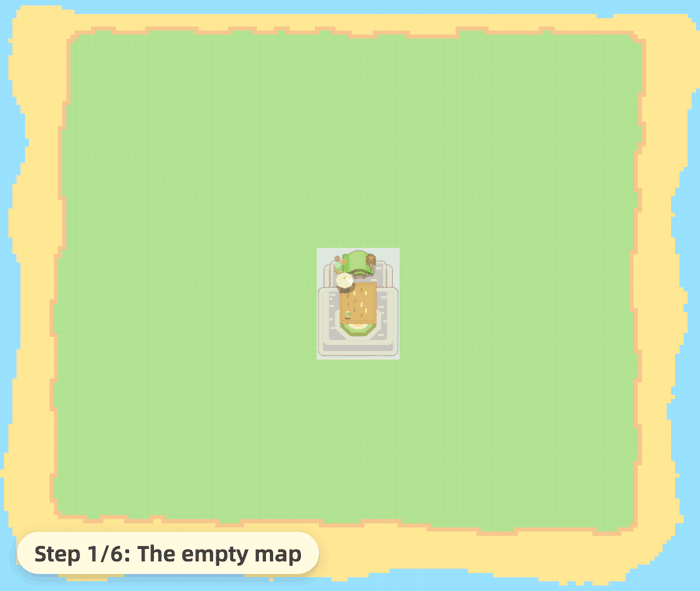

<div align="center">

<picture>
  <source media="(prefers-color-scheme: dark)" srcset="./docs/media/banner-dark.svg">
  
</picture>

**English | [简体中文](./docs/README.zh-CN.md)**

_Cozy, rule-perfect map planning for **[Petit Planet](https://planet.hoyoverse.com/en-us/home)**._

[](https://petit-maker.com)
&nbsp;
&nbsp;[](./LICENSE)


<sub>The island is 鱼松的爱心桃花岛, built cell by cell by 鱼松 (see Credits). You can download and import it further down the page.</sub>

</div>

**PetitMaker** is a map editor for *Petit Planet* that runs in your browser. Plan an island here, then build it in the game. Every edit is checked against the game's building rules for terrain, water, placement, edge cuts, bridges, ramps and roads, and an edit the game would not allow is undone.

PetitMaker is an independent, **unofficial** fan project. It is **not affiliated** with, endorsed by, or sponsored by miHoYo / HoYoverse (COGNOSPHERE PTE. LTD.). *Petit Planet* and related names, characters, and material are the property of their respective owners. See [Affiliation & licensing](#affiliation--licensing) below.

- **Live site:** <https://petit-maker.com>
- **Repository:** <https://github.com/Stry233/PetitMaker>

## Two views, one map

<div align="center">


<sub>One map, both views: the house in the heart garden, selected with a click, and still selected after the switch.</sub>
</div>

2D and 3D are both editing views of the same grid, and every tool works in either one: brushes, shapes, the eraser, item placement, edge cuts, region select, undo. Switch views mid-edit and you keep the same map, the same selection and the same history. The 3D side adds animated water, soft shadows, and a model for every placed item. The corner you round in 2D is the corner you orbit in 3D.

## Draw a mountain, and the rules come with it

Painting terrain works like any pixel editor: free brush, line, curve, rectangle, circle, a brush-size dial. What differs is what happens after the stroke. Paint water with nowhere to rest, or a peak with nothing under it, and the editor undoes that one stroke and names the rule it broke. Items are checked before they land instead of after: one that cannot stand where you are pointing is refused, with the same message.

<div align="center">


<sub>The same refusal in both views: a tree cannot stand on the lip of a step. The 3D view is where you can see why.</sub>
</div>

The rest of the toolbox is for detail work. The edge-cut tool trims mountain corners one click at a time, or auto-trim does it as you paint, in whichever of its two shapes you pick. The eraser takes one layer per pass. Items snap to the grid, rotate on click, and drag to a new spot. A bridge needs two flat banks of equal height and snaps into place once it has them. Autosave keeps your last session, and the interface is available in seven languages. No account, no server.

The layers panel opens from the elevation count and grows through three sizes, up to the whole stack at once. Every floor carries its own cell count, visibility eye and lock, so you can hide the canopy while you work on the ground, or lock a finished terrace against a stray stroke.

<div align="center">


<sub>The layers panel at its three sizes: the count, the file, the whole stack, and back. Each press is the panel's own control.</sub>
</div>

<div align="center">


<sub>One mountain, three settings: auto-trim <b>Off</b>, <b>Bevel</b>, <b>Round</b>. Only the outer corners move. Inner corners stay square, and a trimmed corner opens onto the step behind it.</sub>
</div>

<div align="center">


<sub>The whole toybox: cabins, facilities, bridges, ramps, trees, and flowers, ready to place. (Plus twenty-five in-game path surfaces you paint like a brush.)</sub>
</div>

## This picture is a map

<div align="center">

</div>

Not a picture *of* the map. The map. **[Download this image](./docs/media/share-map.png)** (save the file itself, not a screenshot of it), drop it onto **[petit-maker.com](https://petit-maker.com)** → Import, and you are holding 鱼松's island from the top of this page: every terrace, every waterway, all three thousand two hundred placements, cell for cell.

The mosaic stripe along the bottom is the **PetitGlyph**: the whole map encoded into visible pixels. Reed-Solomon error correction carries it through compression and re-sharing, and it verifies itself on import, so it either rebuilds the exported map cell for cell or reports that the image is too damaged to read. Nothing is uploaded. The picture is the save file.

## The generator: watch an island grow

<div align="center">


<sub>One recipe, six steps: the generator terraces the ground, settles the water, lays the streets, then moves everyone in.</sub>
</div>

The Generate shelf offers four kinds of island. **Island** and **Maze** build from a recipe number, through the same rules your brush obeys, and the same number always produces the same map, so a number you like is a number you can share. **Letter** and **Picture** build from what you bring: a phrase raised as terrain or tiled with an item you pick, or a dropped image read as ground, water and plantings.

<div align="center">


<sub>One recipe number, two kinds: <b>Island</b> settles a place, <b>Maze</b> fills the same ground with corridors.</sub>
</div>

**Island** designs a whole place before it touches a cell: terrace plates, a few long streets cutting the island into districts, themed places seated along them, water composed into the ground, then homes with roads to every door. Its one style knob is **Scenery richness**: the quiet end is a flat garden town, the full end a terraced island.

<div align="center">


<sub>One recipe, the knob's whole range: <b>Scenery richness</b> 0, 50, 100. A flat garden town on the left, a terraced island on the right.</sub>
</div>

**Maze** fills the buildable ground with a recursive backtracker's maze, every corridor reaching every other one. Its walls are ordinary mountain, so you can paint, trim and decorate them afterwards, and a selected region keeps the maze to one corner of the map. You can even drag its entrance and exit where you want them, and ask it to pave the answer.

<div align="center">


<sub><b>Corridor</b> 1, 2, 3: not three samples, the setting's whole range. Same recipe number, wider passages, fewer walls.</sub>
</div>

## An agent that builds beside you

Bring your own API key. It is encrypted on your device and speaks only to the platform you picked, and the agent reaches your map and nothing else: no storage, no page access, no network of its own.

<div align="center">


<sub>Ten platforms to pick from, and the last row is anything that speaks the OpenAI protocol, including a model running on your own machine.</sub>
</div>

Ask for a cozy village, a terraced hill park, a river crossing, an alpine cascade, a zen garden or a field of rice terraces. It knows what those are made of, and builds one on your map.

Point at where you want it: select a hillside, ask for the work *there*, and there is where it happens.

It writes the plan out before it builds, and waits for your go. While it works you can send it a note to change course, stop it at the end of the step it is on, or send it back to an earlier stage and take a different road from there. Every stage is a rewind point, and the whole run is one undo away.

<div align="center">


<sub>One job, three moments: the plan waits for your go, the build ticks through its stages, and the receipt says what stands, one undo away.</sub>
</div>

You choose how often it checks in. **Strict** waits for your ok on every edit, **Checkpoint** asks before plans and big steps and lets small edits through, **YOLO** never waits.

And it gets told no. It goes through the same checks your brush does, and the editor answers in words:

> **agent** · `paint_terrain` water across the ridge at F6…
>
> **editor** · `REVERTED: Water: waterfall needs mountain caps on both ends`
>
> **agent** · "The fall was uncapped. Capping both flanks first, then re-running the water."

## Under the hood

<div align="center">
<picture>
  <source media="(prefers-color-scheme: dark)" srcset="./docs/media/underhood-dark.svg">
  
</picture>
</div>

For readers who want the mechanism, and for contributors: four behaviours the editor holds to, and where each one lives.

- **Everyone edits through the same path.** Your brush, the generator and the agent all produce Commands, and every Command goes through one executor (`core/commands/command-executor`) with validation on both sides of it: rules that refuse a command before it applies, and a second pass over the finished stroke that rolls the whole stroke back if the result is illegal. Nothing has a private route in, the agent least of all, so an AI edit cannot leave a map in a state your own hand could not.
- **A share image imports exactly or not at all.** The PetitGlyph band carries the map through Reed-Solomon error correction, and the payload ends in a SHA-256 of the canonical map. Import decodes, rebuilds and compares: it either hands back the exported map cell for cell, or it says the image is too damaged to read. There is no partial import, and nothing is uploaded to check.
- **The same recipe always produces the same island.** Every random number in generation comes from one seeded generator (mulberry32) and every tie is broken by index, so a recipe number replays byte for byte on any machine. That is also why a generated map's share code is small: it stores the recipe, not the terrain.
- **Automated tests hold these in place.** `npm run test:run` covers the rule set, the codec and the generator, and one of its tests imports the share image on this page and fails if that picture ever stops being a working map.

The full tour: [docs/ARCHITECTURE.md](./docs/ARCHITECTURE.md) (the engine) and [docs/THREAT_MODEL.md](./docs/THREAT_MODEL.md) (build hardening, CSP, the key vault, the agent sandbox).

## Quick start

Requires [Node.js](https://nodejs.org) 24 or newer.

```bash
npm install
npm run dev          # Vite dev server
```

<details>
<summary>Other commands (test, lint, build)</summary>

```bash
npm run test:run     # Vitest (all tests)
npm run lint         # TypeScript type-check (tsc --noEmit)
npm run build        # Production build
```

</details>

## Contributing

Contributions are welcome. Code contributions are accepted **inbound = outbound** under Apache-2.0 with a **Developer Certificate of Origin** sign-off (`git commit -s`); art and other non-code assets need a separate written permission record first. See [CONTRIBUTING.md](./CONTRIBUTING.md) for the full process.

## Affiliation & licensing

PetitMaker is an independent, unofficial fan project, **not affiliated** with, endorsed by, or sponsored by miHoYo / HoYoverse (COGNOSPHERE PTE. LTD.). *Petit Planet* and related names, characters, and material are the property of their respective owners.

This repository mixes materials under different terms. **Do not assume that because the code is open source, the art, brand, or any game-referential material is free to reuse:**

1. **Code**: licensed **Apache-2.0** (see [LICENSE](./LICENSE) and [NOTICE](./NOTICE)).
2. **Brand, logo, and original art**: the PetitMaker name (and its Chinese name 谷地工坊), logo, and original artwork are **All Rights Reserved** unless a specific file states otherwise.
3. **Third-party assets and fonts**: keep **their own licenses**. See [THIRD_PARTY_NOTICES.md](./docs/THIRD_PARTY_NOTICES.md) for bundled software and shipped fonts.
4. **User maps**: maps and other content you create in the editor belong to **you**, subject to any third-party material they incorporate. Sharing the screenshots and export images the editor produces of your maps is expressly permitted, even though they embed our art; the details are in [ASSET_LICENSES.md](./docs/ASSET_LICENSES.md).

The full ownership breakdown, provenance disclosure, and IP-request process are in [ASSET_LICENSES.md](./docs/ASSET_LICENSES.md).

## Credits

In alphabetical order, not a ranking.

<table align="center">
<tr>
<td align="center"><a href="https://space.bilibili.com/16699168"><br><sub><b>火山野牛王</b></sub></a></td>
<td align="center"><a href="https://space.bilibili.com/25599535"><br><sub><b>镜喵MirrorCat</b></sub></a></td>
<td align="center"><a href="https://space.bilibili.com/3546659724200757"><br><sub><b>Selka</b></sub></a></td>
<td align="center"><a href="https://space.bilibili.com/3632319829116985"><br><sub><b>鱼松吃点吗</b></sub></a></td>
</tr>
</table>

## Legal & policy documents

| Document | Purpose |
|---|---|
| [LICENSE](./LICENSE) | Apache-2.0 code license |
| [ASSET_LICENSES.md](./docs/ASSET_LICENSES.md) ([中文](./docs/ASSET_LICENSES.zh-CN.md)) | Four-way ownership scope: code / brand & art / third-party / user maps |
| [THIRD_PARTY_NOTICES.md](./docs/THIRD_PARTY_NOTICES.md) | Bundled software dependencies and shipped fonts |
| [SECURITY.md](./SECURITY.md) ([中文](./docs/SECURITY.zh-CN.md)) | Vulnerability reporting policy |
| [docs/THREAT_MODEL.md](./docs/THREAT_MODEL.md) | Developer threat model (build, headers/CSP, key vault, agent sandbox) |
| [CONTRIBUTING.md](./CONTRIBUTING.md) | DCO sign-off, code/asset contribution terms, credit policy |
| [CHANGELOG.md](./docs/CHANGELOG.md) ([中文](./docs/CHANGELOG.zh-CN.md)) | Release history (Keep a Changelog) |

## Contact

For general questions, IP requests, or contribution/credit arrangements, email **selka.craft@outlook.com**. Security issues follow a separate process. See [SECURITY.md](./SECURITY.md).

<div align="center">
<br>


<sub>© 2026 PetitMaker contributors · Apache-2.0 · an unofficial fan project, not affiliated with miHoYo / HoYoverse</sub>
</div>
