<div align="center">

<picture>
  <source media="(prefers-color-scheme: dark)" srcset="./docs/media/banner-dark.svg">
  
</picture>

**English | [简体中文](./docs/README.zh-CN.md)**

_A browser-based map planner for **[Petit Planet](https://planet.hoyoverse.com/en-us/home)**, with validation against the game's building rules._

[](https://petitmaker.cc/)
&nbsp;
&nbsp;[](./LICENSE)

[](https://www.patreon.com/c/PetitMaker)
&nbsp;[](https://afdian.com/a/PetitMaker)

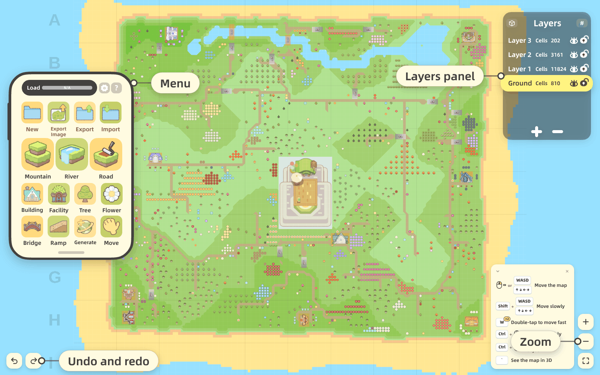

<sub>The header shows 鱼松的爱心桃花岛, created by project contributor 鱼松. An importable share image is available below.</sub>

</div>

**PetitMaker** is a map editor for *Petit Planet* that runs in your browser. Plan your planet here, then build it in the game. Edits are checked against the implemented rules for terrain, water, placement, edge cuts, bridges, ramps and roads. Game updates and actual building conditions may differ; check your plan in the game before building.

PetitMaker is an independent, **unofficial** fan project. It is **not affiliated** with, endorsed by, or sponsored by miHoYo / HoYoverse (COGNOSPHERE PTE. LTD.). *Petit Planet* and related names, characters, and material are the property of their respective owners. See [Affiliation & licensing](#affiliation--licensing) below.

- **International site:** <https://petitmaker.cc/>
- **Chinese site:** <https://petitmaker.com.cn/>
- **Repository:** <https://github.com/Stry233/PetitMaker>

## Two views, one map

<div align="center">
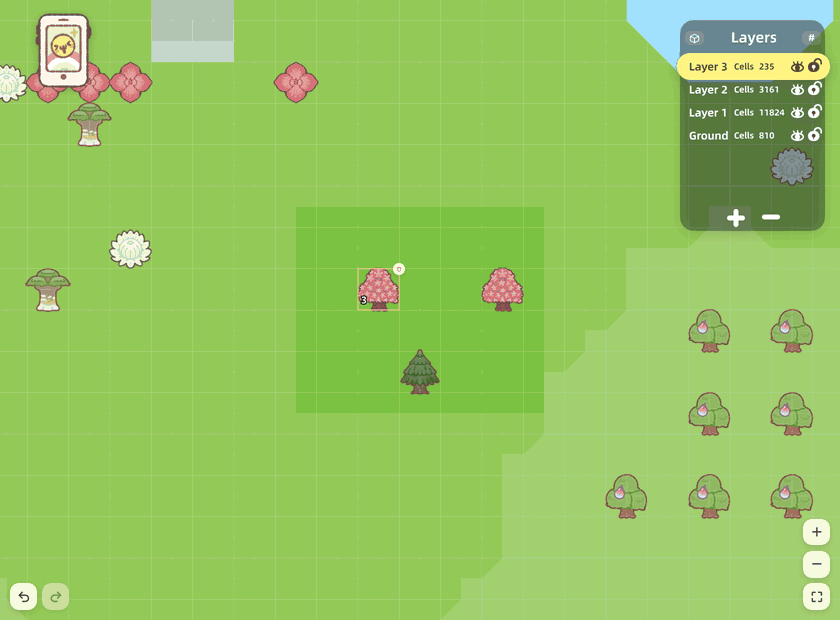

<sub>One map, both views: the house in the heart garden, selected with a click, and still selected after the switch.</sub>
</div>

The 2D and 3D editors use the same grid and support the same brushes, shapes, eraser, item placement, edge cutting, region selection, and undo history. Switching views does not change the map or current selection. The 3D view also displays animated water, shadows, and models for placed items; terrain corners edited in 2D appear with the same shape in 3D.

## Draw terrain with building-rule checks

Terrain tools work like those in a pixel editor: free brush, line, curve, rectangle, circle, and brush-size control. After each stroke, the editor checks the result. Invalid changes, such as uncontained water or high terrain without enough support, are reverted with an explanation. Item placement is checked before the item is added, and invalid locations show the applicable reason.

<div align="center">
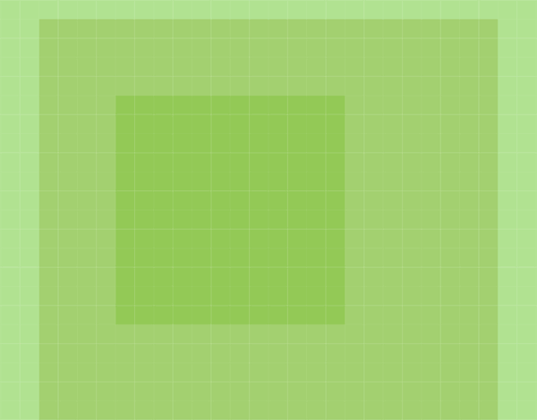

<sub>A tree cannot be placed at the edge of a step. Both views reject the placement, while the 3D view makes the elevation change easier to see.</sub>
</div>

Other tools provide more detailed control. The edge-cut tool changes individual terrain corners, while auto-trim applies bevelled or rounded corners as terrain is drawn. The eraser lowers terrain one layer per pass. Items snap to the grid and can be selected, rotated when supported, or moved. Bridges align automatically when both ends are flat and at the same height. The app includes browser-local autosave and a multilingual interface, requires no account, and does not store maps on a project-operated server.

The layer readout opens a panel with three display sizes, including a grid of all layers. Each layer shows its cell count and has separate visibility and lock controls, allowing upper layers to be hidden or completed terrain to be protected from further editing.

<div align="center">
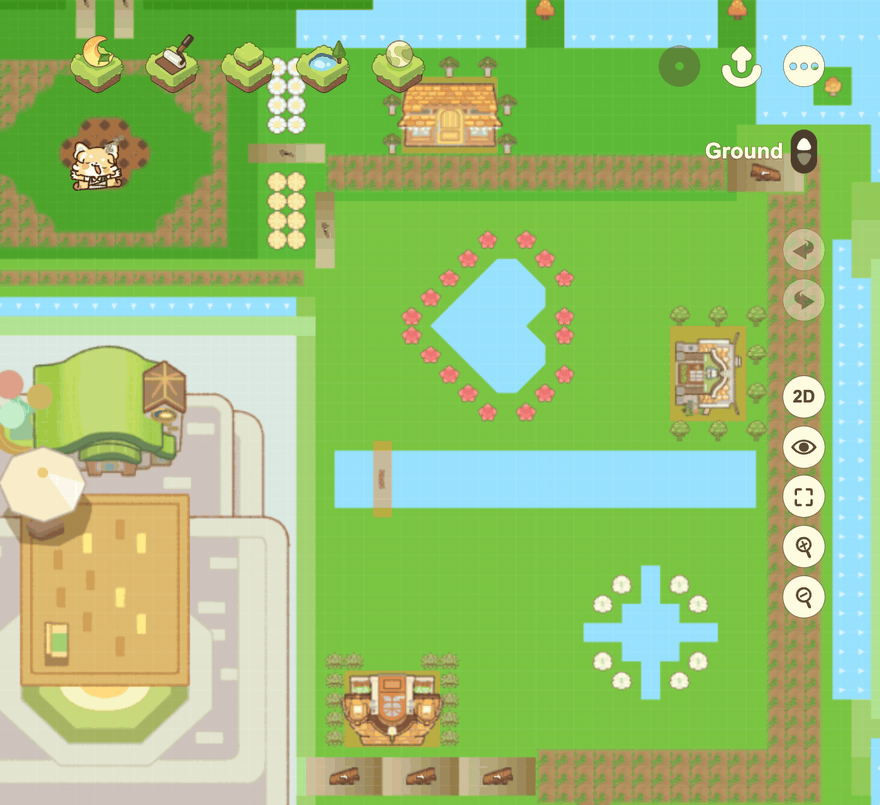

<sub>The layer panel switches between a compact readout, a single-column list, and a grid containing every layer.</sub>
</div>

<div align="center">
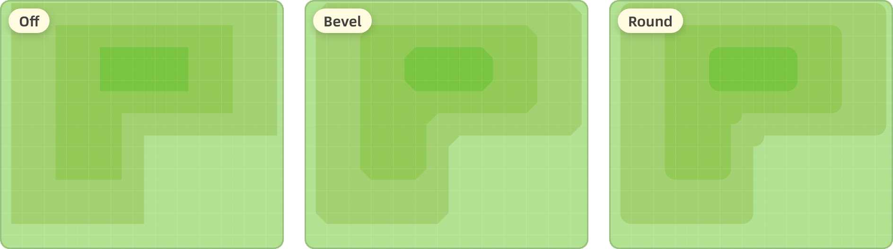

<sub>The same terrain with auto-trim set to <b>Off</b>, <b>Bevel</b>, and <b>Round</b>. Auto-trim changes outer corners and leaves inner corners square.</sub>
</div>

<div align="center">
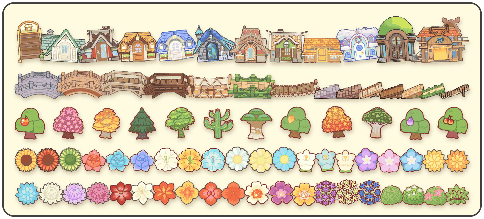

<sub>The object shelf contains cabins, facilities, bridges, ramps, trees, flowers, and other plants. In-game path surfaces are drawn with a brush.</sub>
</div>

## Import a map from its share image

<div align="center">
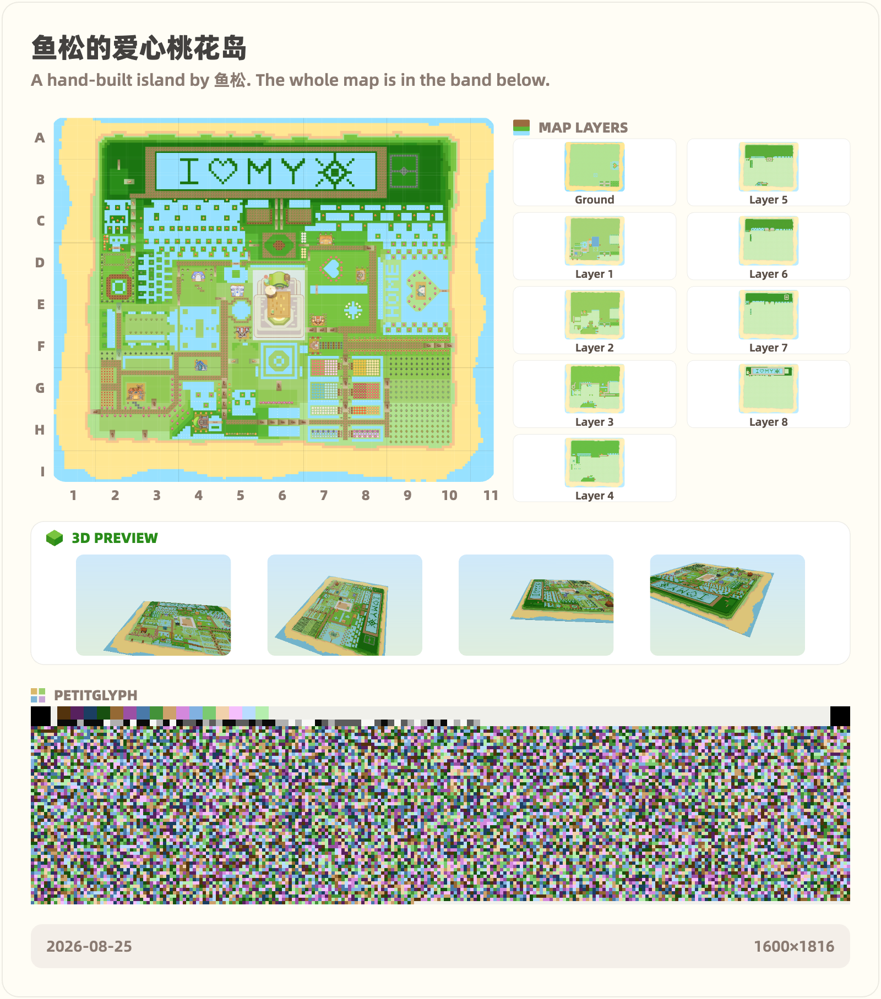
</div>

This share image contains the complete map data. **[Download the original image](./docs/media/share-map.png)** (save the file rather than taking a screenshot), then drop it into the Import window at **[petitmaker.cc](https://petitmaker.cc/)**. The editor will restore 鱼松's planet from the header, including its terrain, water, and objects.

The band at the bottom is a **PetitGlyph** code, which stores the map and its planning annotations in the image. Error correction tolerates some resizing and JPEG or WebP compression. Preserve the original file for reliable sharing; platform processing may make a code unreadable. Import verifies the data before restoring the map. Processing takes place in the browser, and the image is not uploaded.

For a separate backup, export a JSON save. Planning annotations are included by default and can be omitted with their own switch; Notes separately controls the title, description and author. Plain images cannot restore an editable map. Browser storage is separate for the mainland China and international sites, so use exported files to move a map between them.

## Turn the plan into an illustration

Before exporting a 2D image, the map can be redrawn as an illustration. Built-in procedural and on-device model styles run locally and require no API key. Online styles use your API key to send a rendered map and style instructions directly to the selected image provider. Images created by a model, whether local or online, include an AI disclosure; procedural styles do not. You can compare several versions with the original before exporting, and the image can still include optional PetitGlyph map data.

<div align="center">
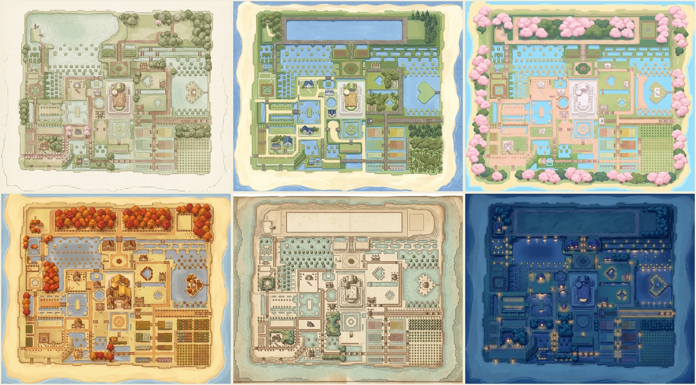

<sub>The same map rendered in several styles. Built-in styles run on the device, and model-generated versions are identified as AI-drawn in the exported image.</sub>
</div>

## Generate a map

<div align="center">


<sub>The generator creates terrain, water, roads, bridges and ramps, buildings, and vegetation in six stages.</sub>
</div>

The generator provides four modes: **Planet**, **Maze**, **Letter**, and **Picture**. Planet and Maze use a recipe number and follow the same building rules as manual editing; the same app version, mode, settings, base map, and recipe produce the same result. Letter and Picture offer built-in designs. Letter converts text into terrain, water, or a pattern made from a selected item. Picture converts an image into terrain, water, objects, or paths.

<div align="center">
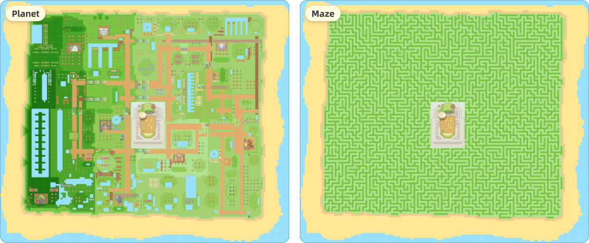

<sub>The same recipe number produces different results in different modes: <b>Planet</b> creates a complete layout, while <b>Maze</b> creates connected corridors.</sub>
</div>

**Planet** calculates a complete layout before applying it to the map. It creates terraces, major roads that divide the planet into districts, themed areas along those roads, water features, buildings, and connections to each entrance. The **Scenery richness** setting controls terrain variation, water, and vegetation density.

<div align="center">
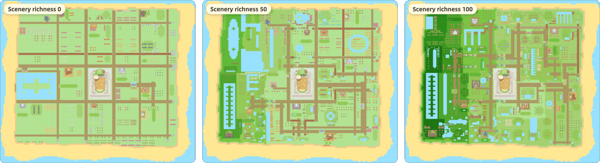

<sub>The same recipe at <b>Scenery richness</b> 0, 50, and 100. Higher values add more elevation changes, water, and vegetation.</sub>
</div>

**Maze** uses recursive backtracking to create a connected maze on buildable ground. Its walls are ordinary terrain, so they can be edited, trimmed, and decorated after generation. A generation region can restrict the maze to part of the map. Its entrance and exit can be moved, and **Show the way** displays the solution route.

<div align="center">
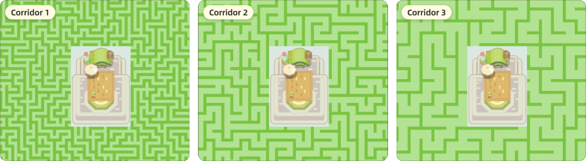

<sub>The same recipe with <b>Corridor</b> set to 1, 2, and 3. Wider corridors produce fewer walls.</sub>
</div>

## Use the agent to edit a map

The agent requires your own API key. Where supported, the browser key vault encrypts it on the device; otherwise, the app stores an obfuscated copy in the current browser. The key authenticates provider requests; automatic identification may also validate it with candidate providers whose key formats match. The agent's tools can read and modify the current map, but cannot access browser storage, other page content, or the general network. Provider requests use the selected integration.

<div align="center">
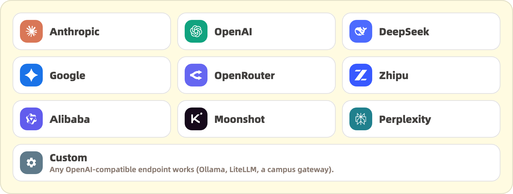

<sub>Choose a supported provider, or use the Custom option for an OpenAI-compatible service, including a model running on your own machine.</sub>
</div>

The agent can follow natural-language instructions to create or modify areas such as villages, hill parks, bridges, waterfalls, dry gardens, and terraces.

You can first select a region to restrict the agent's edits to that part of the map.

The agent presents a plan for approval before execution when the selected oversight level requires it. While a task is running, you can add instructions, pause after the current step, or return to an earlier stage and continue with revised requirements. Each stage is a rollback point, and task rollback uses the available undo history. Returning to an earlier stage also undoes later edits.

<div align="center">
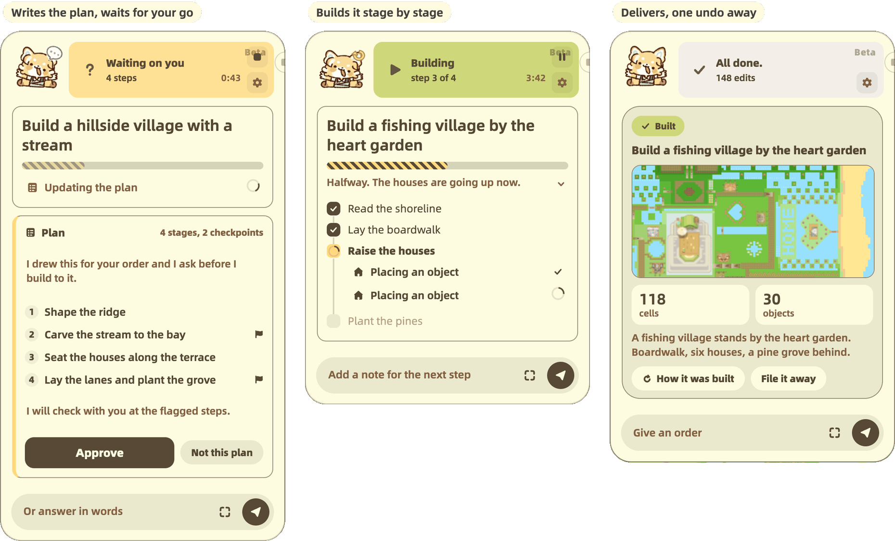

<sub>An agent task in three stages: awaiting plan approval, executing the plan, and displaying a receipt that summarizes the changes.</sub>
</div>

Three oversight levels are available. **Strict** asks before every map change, **Checkpoint** asks before plans and large changes, and **Autopilot** proceeds without step-by-step confirmation. Changes made under any level can be undone.

Agent edits use the same rule checks as manual edits. If an operation is invalid, the editor reports the reason so the agent can revise its approach:

> **Agent:** Placing water along the ridge at F6…
>
> **Editor:** Reverted. Water: waterfall needs mountain caps on both ends.
>
> **Agent:** "The waterfall is missing mountain caps on both sides. I will add them before placing the water again."

## Under the hood

<div align="center">
<picture>
  <source media="(prefers-color-scheme: dark)" srcset="./docs/media/underhood-dark.svg">
  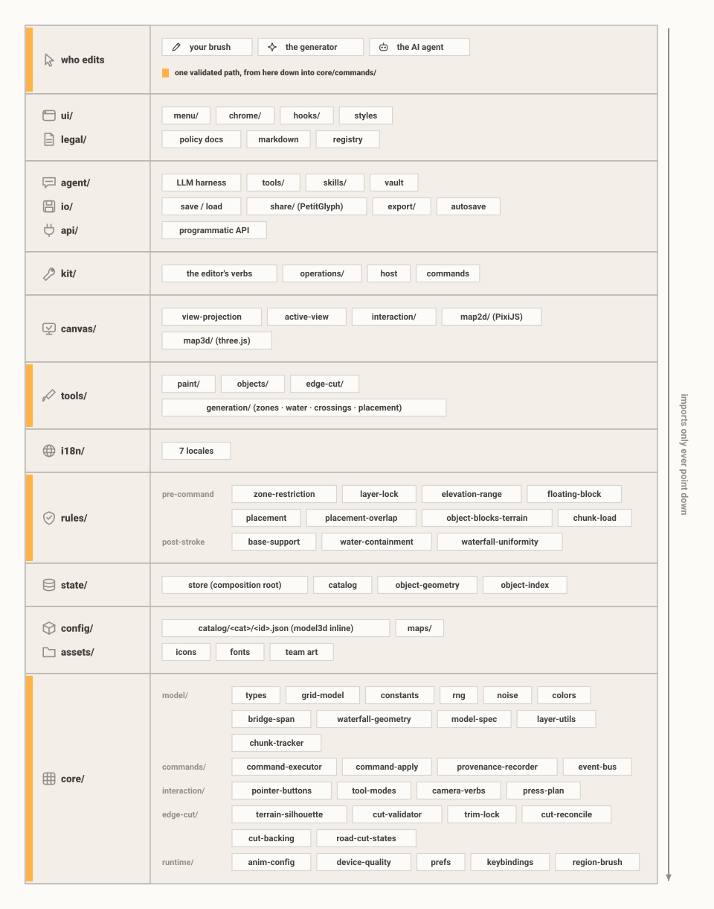
</picture>
</div>

Four design constraints keep map data and editing results consistent:

- **Every editor uses the same command path.** Manual tools, the generator, and the agent all produce commands handled by the same executor (`core/commands/command-executor`). Rules may reject a command before it runs and validate the completed stroke afterward, reverting invalid changes.
- **A share image imports completely or fails.** The PetitGlyph band carries the map through Reed-Solomon error correction, and its SHA-256 covers the canonical map and planning notes. Import decodes, rebuilds, and compares the data. It either returns the complete exported map or reports that the image is too damaged to read. Validation runs locally.
- **Generation is reproducible from its complete inputs.** Within the same app version, the recipe, generation kind, and settings drive one seeded generator (mulberry32), with ties broken by index. A share image does not rely on replaying that algorithm: its payload contains the complete canonical map, while an optional recipe note records how the map was generated.
- **Automated tests verify these constraints.** `npm run test:run` covers the rules, codec, and generator. One test imports the share image on this page and fails if it can no longer restore its map.

The full tour: [docs/ARCHITECTURE.md](./docs/ARCHITECTURE.md) (the engine) and [docs/THREAT_MODEL.md](./docs/THREAT_MODEL.md) (build hardening, CSP, the key vault, the agent sandbox).

## Quick start

Requires [Node.js](https://nodejs.org) 24 or newer.

```bash
npm install
npm run dev          # Vite dev server
```

<details>
<summary>Other commands (test, lint, build)</summary>

```bash
npm run test:run     # Vitest (all tests)
npm run lint         # TypeScript type-check (tsc --noEmit)
npm run build        # Production build
```

</details>

## Contributing

Contributions are welcome. Code contributions are accepted **inbound = outbound** under Apache-2.0 with a **Developer Certificate of Origin** sign-off (`git commit -s`); art and other non-code assets need a separate written permission record first. See [CONTRIBUTING.md](./CONTRIBUTING.md) for the full process.

## Affiliation & licensing

PetitMaker is an independent, unofficial fan project, **not affiliated** with, endorsed by, or sponsored by miHoYo / HoYoverse (COGNOSPHERE PTE. LTD.). *Petit Planet* and related names, characters, and material are the property of their respective owners.

Code, artwork, branding and third-party material in this repository have separate licenses. **Check the applicable permissions before using or redistributing each category:**

1. **Code**: licensed **Apache-2.0** (see [LICENSE](./LICENSE) and [NOTICE](./NOTICE)).
2. **Brand, logo, and original art**: the PetitMaker name (and its Chinese name 谷地工坊), logo, and original artwork are **All Rights Reserved** unless a specific file states otherwise.
3. **Third-party assets and fonts**: keep **their own licenses**. See [THIRD_PARTY_NOTICES.md](./docs/THIRD_PARTY_NOTICES.md) for bundled software and shipped fonts.
4. **User maps**: maps and other content you create in the editor belong to **you**, subject to any third-party material they incorporate. Sharing the screenshots and export images the editor produces of your maps is expressly permitted, even though they embed our art; the details are in [ASSET_LICENSES.md](./docs/ASSET_LICENSES.md).

The full ownership breakdown, provenance disclosure, and IP-request process are in [ASSET_LICENSES.md](./docs/ASSET_LICENSES.md).

## Credits

In alphabetical order, not a ranking.

<table align="center">
<tr>
<td align="center"><a href="https://space.bilibili.com/16699168"><br><sub><b>火山野牛王</b></sub></a></td>
<td align="center"><a href="https://space.bilibili.com/25599535"><br><sub><b>镜喵MirrorCat</b></sub></a></td>
<td align="center"><a href="https://space.bilibili.com/3546659724200757"><br><sub><b>Selka</b></sub></a></td>
<td align="center"><a href="https://space.bilibili.com/3632319829116985"><br><sub><b>鱼松吃点吗</b></sub></a></td>
</tr>
</table>

## Acknowledgements

Thanks to these community members for their support. In alphabetical order, not a ranking.

<table align="center">
<tr>
<td align="center"><a href="https://space.bilibili.com/215541807"><br><sub><b>晶焰EXFire</b></sub></a></td>
<td align="center"><a href="https://space.bilibili.com/671142687"><br><sub><b>星灭散落</b></sub></a></td>
<td align="center"><a href="https://space.bilibili.com/397542864">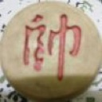<br><sub><b>奕言君</b></sub></a></td>
</tr>
</table>

## Support the project

You can support PetitMaker’s ongoing development on [Patreon](https://www.patreon.com/c/PetitMaker) or [Afdian](https://afdian.com/a/PetitMaker). Thank you for your support.

## Legal & policy documents

| Document | Purpose |
|---|---|
| [LICENSE](./LICENSE) | Apache-2.0 code license |
| [ASSET_LICENSES.md](./docs/ASSET_LICENSES.md) ([中文](./docs/ASSET_LICENSES.zh-CN.md)) | Four-way ownership scope: code / brand & art / third-party / user maps |
| [THIRD_PARTY_NOTICES.md](./docs/THIRD_PARTY_NOTICES.md) | Bundled software dependencies and shipped fonts |
| [SECURITY.md](./SECURITY.md) ([中文](./docs/SECURITY.zh-CN.md)) | Vulnerability reporting policy |
| [docs/THREAT_MODEL.md](./docs/THREAT_MODEL.md) | Developer threat model (build, headers/CSP, key vault, agent sandbox) |
| [CONTRIBUTING.md](./CONTRIBUTING.md) | DCO sign-off, code/asset contribution terms, credit policy |
| [CHANGELOG.md](./docs/CHANGELOG.md) ([中文](./docs/CHANGELOG.zh-CN.md)) | Release history (Keep a Changelog) |

## Contact

For general questions, IP requests, or contribution/credit arrangements, email **petit.maker@outlook.com**. Security issues follow a separate process. See [SECURITY.md](./SECURITY.md).

<div align="center">
<br>
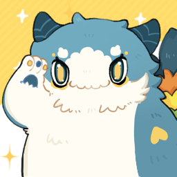

<sub>© 2026 PetitMaker contributors · Apache-2.0 · an unofficial fan project, not affiliated with miHoYo / HoYoverse</sub>
</div>
