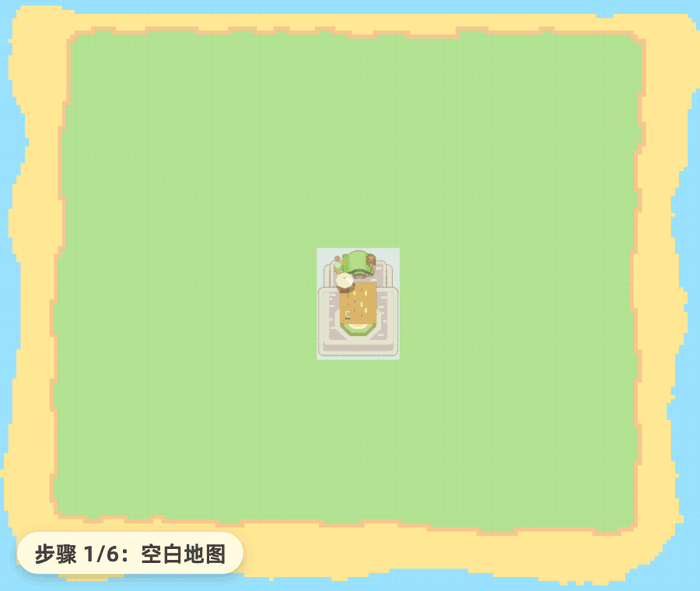

<div align="center">

<picture>
  <source media="(prefers-color-scheme: dark)" srcset="./media/banner-zh-dark.svg">
  
</picture>

**[English](../README.md) | 简体中文**

_为《[星布谷地](https://planet.mihoyo.com/home)》设计的地图规划工具，操作直观，并按游戏规则校验建造内容。_

[](https://petitmaker.com.cn/)
&nbsp;
&nbsp;[](../LICENSE)

[](https://www.patreon.com/c/PetitMaker)
&nbsp;[](https://afdian.com/a/PetitMaker)


<sub>页首展示的是团队成员鱼松制作的「鱼松的爱心桃花岛」。下文提供可直接导入的分享图。</sub>

</div>

**谷地工坊**是一款在浏览器中运行的《星布谷地》地图编辑器。您可以先在这里规划地图，再按规划到游戏中搭建。编辑器会依据游戏中的地形、水体、放置、边角切割、桥梁、坡道与道路规则校验每项操作，并撤销不符合规则的修改。游戏版本和实际建造条件可能有所差异，搭建前请在游戏中核对。

谷地工坊是一个独立的**非官方**粉丝项目，**与**米哈游及其海外品牌 HoYoverse（COGNOSPHERE PTE. LTD.）**无隶属关系**，未获其认可或赞助。《星布谷地》及相关名称、角色与素材归其各自权利人所有。详见下方[隶属关系与授权](#隶属关系与授权)。

- **中国大陆站点：**<https://petitmaker.com.cn/>
- **国际站点：**<https://petitmaker.cc/>
- **代码仓库：**<https://github.com/Stry233/PetitMaker>

## 两个视图，同一张地图

<div align="center">


<sub>在 2D 视图中选中心形花园里的小屋，切换到 3D 视图后仍保持选中。</sub>
</div>

2D 与 3D 视图共享同一张网格地图，均可使用笔刷、形状、橡皮擦、物品放置、边角切割、区域选择和撤销等功能。编辑过程中切换视图不会改变地图、选中项或操作历史。3D 视图还会显示水面动画、阴影和各类物品的模型；在 2D 视图中修整的山体边角会同步反映在 3D 模型上。

## 按游戏规则绘制地形

地形工具的操作方式与常见绘图软件相似，包括自由笔刷、直线、曲线、矩形、圆形和笔刷大小调节。每次绘制完成后，编辑器会检查结果；未被山体围合的水面、缺少下方支撑的高层地形等无效修改会被撤销，并显示对应原因。物品会在放置前接受检查，无法放置的位置也会显示原因。

<div align="center">


<sub>树木不能放在台阶边缘。2D 与 3D 视图都会拒绝该操作，3D 视图可更直观地显示高度变化。</sub>
</div>

其他工具可用于细节调整。边角切割工具可逐个修改山体边角；自动修边则会在绘制时应用切角或圆角。橡皮擦每次降低一层地形。物品会吸附到网格，可选中后移动；支持旋转的物品还可以调整朝向。桥梁要求两端地面平整且高度相同，满足条件时会自动对齐。应用会自动保存当前进度，界面支持多种语言；使用时不需要账号，地图也不会存储到项目服务器。

点击图层读数可展开图层面板。面板有三种显示大小，最大尺寸会同时列出全部图层。每层均显示格数，并提供显示和锁定开关；例如，编辑地面时可以暂时隐藏上层内容，也可以锁定已经完成的台地以防误改。

<div align="center">


<sub>图层面板可在图层读数、单列列表与完整图层网格三种大小之间切换。</sub>
</div>

<div align="center">


<sub>同一座山应用三种自动修边设置：<b>关闭</b>、<b>切角</b>与<b>圆角</b>。设置只修改外侧边角，内侧边角保持方形。</sub>
</div>

<div align="center">


<sub>物品架包含小屋、设施、桥梁、坡道、树木与花草；游戏中的地面材质则通过笔刷绘制。</sub>
</div>

## 分享图片可以直接导入

<div align="center">

</div>

这张分享图包含完整的地图数据。**[下载原图](./media/share-map.zh.png)**（请保存图片文件，不要使用截图），然后将文件拖入 **[petitmaker.com.cn](https://petitmaker.com.cn/)** 的导入窗口，即可打开页首展示的「鱼松的爱心桃花岛」。其中的台地、水面和物品都会按原地图恢复。

图片底部的色带称为 **PetitGlyph**，其中保存了地图和规划标注。纠错机制可以容忍一定程度的缩小和 JPEG、WebP 压缩。为保证分享可靠，请保留原始文件；发布平台的图片处理仍可能使地图码无法读取。导入时会先校验数据，再打开地图。此过程在浏览器本地完成，不会上传图片。

需要独立备份时，可以导出 JSON 存档。「规划标注」默认开启，也可单独关闭；「备注」控制标题、描述和作者。普通图片无法恢复为可编辑地图。中国大陆站点与国际站点的浏览器存档相互独立，切换站点时可以通过文件导出、导入来转移地图。

## 把规划图变成插画

导出 2D 图片前，可以将地图重绘为插画。内置的程序画风与本地模型画风都在设备上运行，不需要 API 密钥；在线画风则使用您提供的密钥，将地图渲染图和风格说明直接发送给所选图像服务商。凡是由模型生成的方案，无论模型在本地还是在线运行，导出图片都会带有 AI 绘制标记；纯程序绘制的方案不带该标记。您可以生成多个方案并与原图比较，选定后再导出。分享图仍可按需包含 PetitGlyph 地图数据。

<div align="center">


<sub>同一张规划图应用不同画风后的效果。内置画风在设备上运行；模型生成的方案会在导出图片中标明由 AI 绘制。</sub>
</div>

## 使用生成器创建地图

<div align="center">


<sub>生成器按照六个阶段依次创建台地、水系、道路、桥梁与坡道、建筑和植被。</sub>
</div>

生成器提供**星球**、**迷宫**、**文字**与**图片**四种方式。星球和迷宫根据配方号生成，并遵循与手动编辑相同的建造规则；应用版本、生成方式、设置和基础地图相同时，同一配方会得到相同结果。文字和图片生成提供内置图案：文字可转换为山体、水面或指定物品组成的图案，图片可转换为地形、水面、物品或道路。

<div align="center">


<sub>同一个配方号用于不同生成方式时会得到不同结果：<b>星球</b>生成完整布局，<b>迷宫</b>生成相互连通的通道。</sub>
</div>

**星球**会先计算整体布局，再生成台地、划分区域的主要道路、沿路分布的主题场所、水系，以及连接各建筑入口的道路。「风景丰富度」滑块用于调节地形起伏、水面数量与植被密度。

<div align="center">


<sub>同一个配方在<b>丰富度</b> 0、50 与 100 时的结果。数值越高，地形起伏、水面和植被越多。</sub>
</div>

**迷宫**使用递归回溯算法在可建造地面上生成连通迷宫。墙体采用普通山体，因此生成后仍可继续绘制、切角和装饰。您也可以圈定生成范围，将迷宫限制在地图的一部分；入口和出口均可拖动，并可开启「显示路线」查看解法。

<div align="center">


<sub>同一个配方在<b>通道宽</b> 1、2 与 3 时的结果。通道越宽，墙体越少。</sub>
</div>

## 使用智能体协助建图

使用智能体需要自备 API 密钥。浏览器支持密钥保管库时，密钥会加密保存在设备上；不支持时，则会经过简单混淆后保存在当前浏览器中。密钥用于向对应服务发送请求；自动识别时，也可能向密钥格式匹配的候选服务商核验。智能体的建图工具可以读取当前地图，但不能访问浏览器存储、页面其他内容或通用网络；所有服务商请求均通过所选适配器发送。

<div align="center">


<sub>可以选择应用支持的服务商，也可以通过「自定义」连接兼容 OpenAI 接口的服务，包括本地运行的模型。</sub>
</div>

智能体可以根据自然语言指令建造村落、山地公园、桥梁、瀑布、枯山水庭园或梯田等场景。

您可以先圈定地图范围，让智能体只在该范围内修改地图。

任务适合分阶段执行时，智能体会先列出计划；当前监督方式要求确认时，需获得确认后才会执行。任务进行期间，您可以补充要求，让智能体在当前步骤完成后暂停，或退回到先前阶段再按新要求继续。任务回退使用当前可用的撤销历史；退回较早阶段时，其后的其他修改也会一并撤销。

<div align="center">


<sub>智能体任务的三个阶段：等待批准的计划、按步骤执行的任务，以及汇总改动内容的完成回执。</sub>
</div>

监督方式分为三档：**严格**会在每次修改前征求确认，**关键节点**只在计划和大范围修改前询问，**自动**则直接执行。三种方式下的修改都可以撤销。

智能体的修改与手动编辑使用同一套规则检查。操作不符合规则时，编辑器会说明原因，智能体可以据此调整方案：

> **智能体：** 正在 F6 山脊铺设水体……
>
> **编辑器：** 已撤销。水体：瀑布两端需要山体封堵。
>
> **智能体：** 「瀑布两侧缺少山体封堵。我会先补齐山体，再重新铺设水体。」

## 实现原理

<div align="center">
<picture>
  <source media="(prefers-color-scheme: dark)" srcset="./media/underhood-zh-dark.svg">
  
</picture>
</div>

以下四项设计约束说明了编辑器如何保证地图数据与操作结果的一致性。

- **所有编辑使用同一条命令通道。** 画笔、生成器和智能体都会生成命令，每条命令均由同一个执行器（`core/commands/command-executor`）处理。规则可以在命令执行前拒绝无效操作，也会在一次笔画结束后检查最终状态，并在结果不符合规则时撤回无效改动。
- **分享图只能完整导入。** PetitGlyph 色带存储地图数据，并使用 Reed-Solomon 纠错；其 SHA-256 覆盖规范地图和规划标注。导入过程会解码、重建并逐格比较数据；只有完整通过校验才会返回地图，否则会提示图片已损坏。校验在本地完成，无需上传图片。
- **完整的生成参数可以复现结果。** 在应用版本相同的前提下，配方号、生成方式和设置共同驱动带种子的随机数发生器（mulberry32），并列选择按索引决定。分享图不依赖重新运行生成算法，而是保存完整的规范地图；可选的配方记录仅用于说明地图的生成方式。
- **自动化测试持续验证这些约束。** `npm run test:run` 覆盖规则集、编解码和生成器，其中一项测试会导入本页的分享图；如果图片无法还原地图，测试便会失败。

想深入了解：[ARCHITECTURE.md](./ARCHITECTURE.md)（引擎）与 [THREAT_MODEL.md](./THREAT_MODEL.md)（构建加固、CSP、密钥保管库与智能体沙箱，均为英文）。

## 快速开始

需要 [Node.js](https://nodejs.org) 24 或更新版本。

```bash
npm install
npm run dev          # Vite 开发服务器
```

<details>
<summary>其他命令（测试、检查、构建）</summary>

```bash
npm run test:run     # 运行全部测试（Vitest）
npm run lint         # TypeScript 类型检查（tsc --noEmit）
npm run build        # 生产构建
```

</details>

## 参与贡献

欢迎贡献。代码贡献与项目的对外分发均采用 **Apache-2.0** 许可（inbound = outbound），并需要 **Developer Certificate of Origin** 签署（`git commit -s`）；美术等非代码素材的贡献则需要先建立单独的书面许可记录。完整流程见 [CONTRIBUTING.md](../CONTRIBUTING.md)（英文）。

## 隶属关系与授权

谷地工坊是一个独立的非官方粉丝项目，**与**米哈游及其海外品牌 HoYoverse（COGNOSPHERE PTE. LTD.）**无隶属关系**，未获其认可或赞助。《星布谷地》及相关名称、角色与素材归其各自权利人所有。

本仓库中的代码、美术、品牌和第三方素材分别适用各自的许可。**使用或再分发时，请按以下类别确认授权范围：**

1. **代码**：采用 **Apache-2.0** 授权（见 [LICENSE](../LICENSE) 与 [NOTICE](../NOTICE)）。
2. **品牌、Logo 与原创美术**：谷地工坊（PetitMaker）的名称、Logo 及原创美术作品，除非特定文件另有声明，均为 **保留所有权利（All Rights Reserved）**。
3. **第三方素材与字体**：保留**其自身的授权条款**。详见 [THIRD_PARTY_NOTICES.md](./THIRD_PARTY_NOTICES.md)（英文）中列出的依赖库与内置字体。
4. **用户地图**：您在编辑器中创作的地图及其他内容归**您**所有，但其中包含的任何第三方素材仍受各自条款约束。编辑器为您的地图生成的截图与导出图片，虽然嵌入了我们的美术素材，但明确允许您直接分享；详见[素材许可](./ASSET_LICENSES.zh-CN.md)。

完整的权属说明、来源披露与知识产权投诉流程见[素材许可](./ASSET_LICENSES.zh-CN.md)。

## 制作团队

按拼音字母顺序排列，不分先后。

<table align="center">
<tr>
<td align="center"><a href="https://space.bilibili.com/16699168"><br><sub><b>火山野牛王</b></sub></a></td>
<td align="center"><a href="https://space.bilibili.com/25599535"><br><sub><b>镜喵MirrorCat</b></sub></a></td>
<td align="center"><a href="https://space.bilibili.com/3546659724200757"><br><sub><b>Selka</b></sub></a></td>
<td align="center"><a href="https://space.bilibili.com/3632319829116985"><br><sub><b>鱼松吃点吗</b></sub></a></td>
</tr>
</table>

## 鸣谢

感谢以下社区成员的支持。按拼音字母顺序排列，不分先后。

<table align="center">
<tr>
<td align="center"><a href="https://space.bilibili.com/215541807"><br><sub><b>晶焰EXFire</b></sub></a></td>
<td align="center"><a href="https://space.bilibili.com/671142687"><br><sub><b>星灭散落</b></sub></a></td>
<td align="center"><a href="https://space.bilibili.com/397542864"><br><sub><b>奕言君</b></sub></a></td>
</tr>
</table>

## 支持项目

您可以通过 [Patreon](https://www.patreon.com/c/PetitMaker) 或[爱发电](https://afdian.com/a/PetitMaker)支持谷地工坊的持续开发。感谢您的支持。

## 法律与政策文件

| 文件 | 用途 |
|---|---|
| [LICENSE](../LICENSE) | Apache-2.0 代码授权（英文） |
| [ASSET_LICENSES.md](./ASSET_LICENSES.md)（[中文版](./ASSET_LICENSES.zh-CN.md)） | 四类权属划分：代码 / 品牌与美术 / 第三方 / 用户地图 |
| [THIRD_PARTY_NOTICES.md](./THIRD_PARTY_NOTICES.md) | 内置依赖库与字体清单（英文） |
| [SECURITY.md](../SECURITY.md)（[中文版](./SECURITY.zh-CN.md)） | 安全漏洞报告政策 |
| [THREAT_MODEL.md](./THREAT_MODEL.md) | 开发者威胁模型（构建、标头/CSP、密钥保管库、智能体沙箱，英文） |
| [CONTRIBUTING.md](../CONTRIBUTING.md) | DCO 签署、代码/素材贡献条款、署名政策（英文） |
| [CHANGELOG.md](./CHANGELOG.md)（[中文版](./CHANGELOG.zh-CN.md)） | 版本历史（遵循 Keep a Changelog） |

## 联系我们

如有使用问题、知识产权投诉，或希望咨询贡献与署名事宜，请发送邮件至 **petit.maker@outlook.com**。安全问题请通过专门的漏洞报告流程反馈。详见 [SECURITY.md](../SECURITY.md)。

<div align="center">
<br>


<sub>© 2026 PetitMaker contributors · Apache-2.0 · 非官方粉丝项目，与米哈游 / HoYoverse 无关</sub>
</div>
