<div align="center">

<picture>
  <source media="(prefers-color-scheme: dark)" srcset="./media/banner-zh-dark.svg">
  
</picture>

**[English](../README.md) | 简体中文**

_为《[星布谷地](https://planet.mihoyo.com/home)》打造、好用而规则严谨的建图规划工具。_

[](https://petitmaker.com.cn)
&nbsp;
&nbsp;[](../LICENSE)

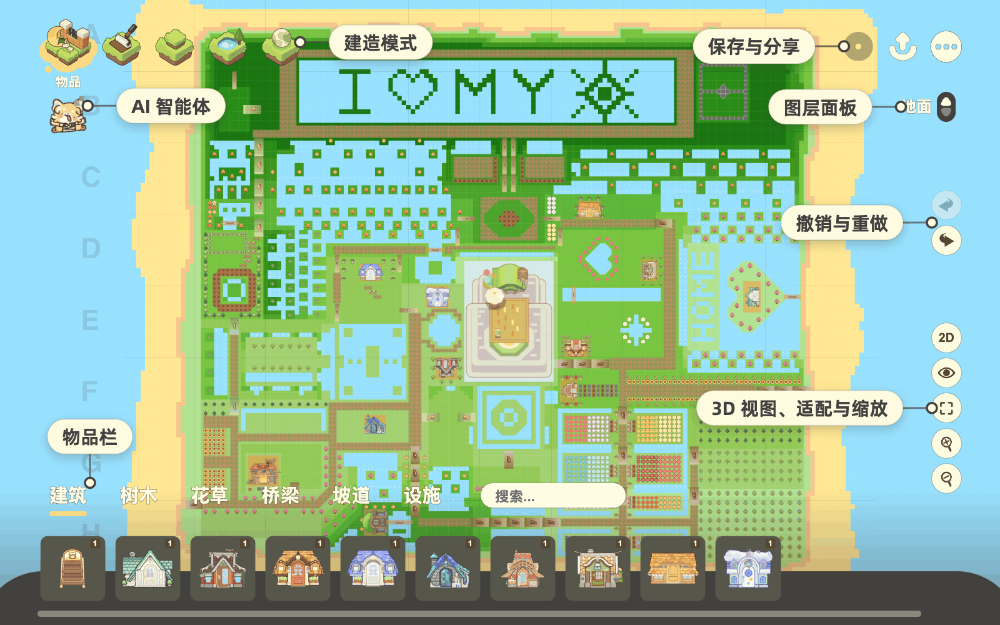

<sub>这座岛是「鱼松的爱心桃花岛」，由鸣谢名单中的鱼松逐格搭成，可以在下文直接下载带走。</sub>

</div>

**谷地工坊**是一个在浏览器里运行的《星布谷地》地图编辑器。先在这里把地图规划好，再到游戏里照着搭。每一次改动都会按游戏的建造规则（地形、水体、放置、边角切割、桥梁、坡道、道路）检查一遍，游戏里不允许的改动会被撤销。

谷地工坊是一个独立的**非官方**粉丝项目，**与**米哈游及其海外品牌 HoYoverse（COGNOSPHERE PTE. LTD.）**无隶属关系**，未获其认可或赞助。《星布谷地》及相关名称、角色与素材归其各自权利人所有。详见下方[隶属关系与授权](#隶属关系与授权)。

- **中国大陆站点：**<https://petitmaker.com.cn>
- **国际站点：**<https://petit-maker.com>
- **代码仓库：**<https://github.com/Stry233/PetitMaker>

## 两个视图，同一张地图

<div align="center">
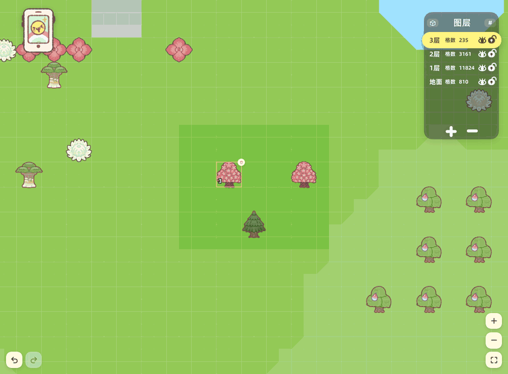

<sub>同一张地图，两个视图：心形花园里的小屋点一下选中，切换视图后选中的还是它。</sub>
</div>

2D 视图和 3D 视图编辑的是同一张网格，工具两边通用：笔刷、形状、橡皮、放置物品、边角切割、区域选择、撤销。编辑到一半切换视图，地图、选中项和历史记录都保持不变。3D 视图另外有水面动画和柔和阴影，每件物品都有对应的模型。在 2D 里修圆的山角，在 3D 里就是同一个斜面。

## 画一座山，规则同时生效

画地形和用普通画板差不多：自由笔刷、直线、曲线、矩形、圆形，外加笔刷大小。区别在落笔之后：画出游戏里不可能出现的东西，比如没有山体围住的水、下面悬空的山，编辑器会撤掉这一笔，并说明是哪条规则没通过。物品则在落地之前就检查：放不下的位置会被直接拒绝，提示方式相同。

<div align="center">
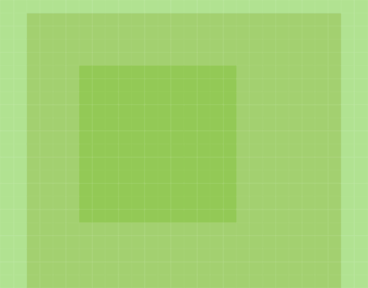

<sub>同一次拒绝，两个视图都给出：树不能站在台阶边缘上。3D 视图里能看清原因。</sub>
</div>

其余的工具用来调细节：边角切割每次修一个山角，也可以打开自动修边，边画边修，形状在切角和圆角里选一种；橡皮每次削掉一层；物品吸附网格，点一下旋转，按住拖走；桥需要两岸平整且高度相同，条件满足时会自动对齐。自动保存会保留上次的进度，界面提供七种语言。不需要账号，也没有服务器。

图层面板从层数计数展开，一共三种大小，最大时整个层叠一目了然。每一层都有自己的格数、显示开关和锁定开关：修整地面时可以先藏起树冠，修好的台地也可以锁住，防止误画。

<div align="center">
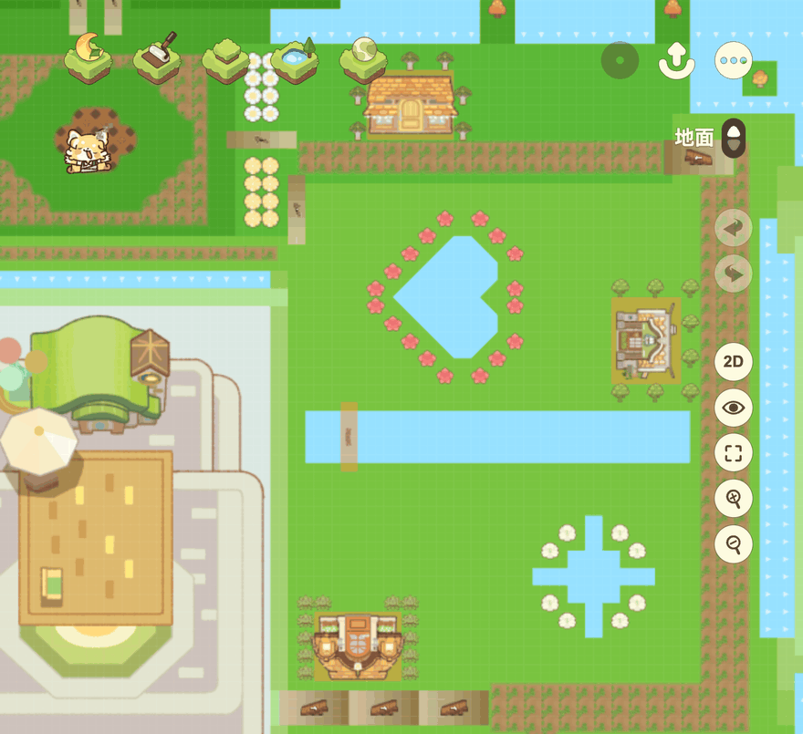

<sub>图层面板的三种大小：计数、单列、完整层叠，再一路收回去。每一步都是面板自己的按钮。</sub>
</div>

<div align="center">
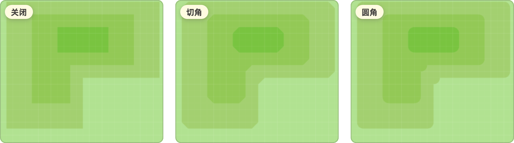

<sub>同一座山，三种设置：自动修边<b>关闭</b>、<b>切角</b>、<b>圆角</b>。只有外侧的角会变，内侧的角保持方形，修过的角会露出后面那一级台地。</sub>
</div>

<div align="center">


<sub>全部可放置物品：小屋、设施、桥、坡道、树和花草。另有二十五种游戏内地面材质，用笔刷直接画。</sub>
</div>

## 这张图片就是地图本身

<div align="center">
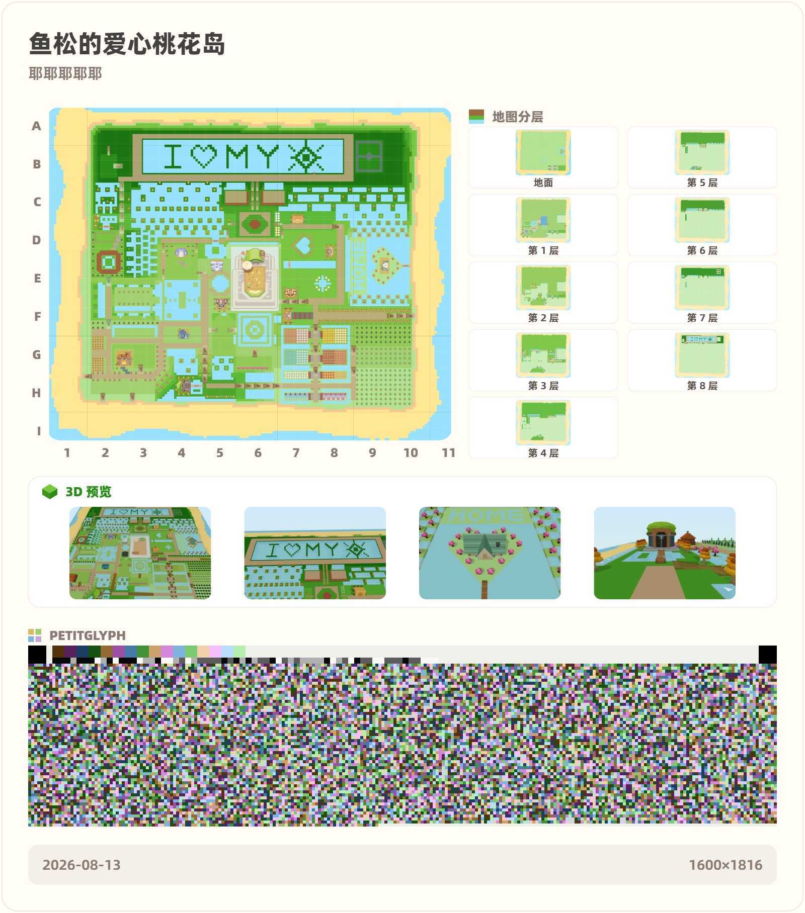
</div>

这张图片里存的就是地图数据。**[下载这张图片](./media/share-map.zh.png)**（保存文件本体，不要截屏），拖进 **[petitmaker.com.cn](https://petitmaker.com.cn)** 的导入框，得到的就是页首鱼松那座岛：每一级台地、每一片水面、三千二百件物品，一格不差。

图片底部那条马赛克色带叫 **PetitGlyph**：整张地图就编码在这些像素里。它带 Reed-Solomon 纠错，经得起压缩和转发；导入时会先校验，校验通过就逐格还原成导出时的地图，不通过就提示图片损坏。全程不上传，图片本身就是存档。

## 生成器：看一座岛长出来

<div align="center">
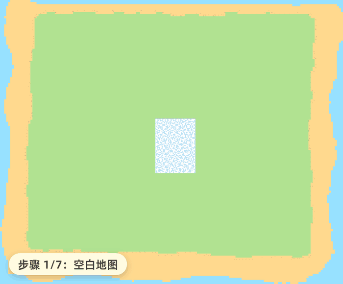

<sub>一个配方号，六个步骤：先垒台地，再安顿水面，然后铺街道，最后搬进住户。</sub>
</div>

生成器一共四种。**岛屿**和**迷宫**只要一个配方号，走的都是和你的画笔同一套规则；同一个号码永远生成同一张图，所以喜欢哪个号码，直接发给朋友就行。**文字**和**图片**则用你带来的东西建岛：一句话可以垒成山、沉成水，或用你选的物品铺出来；一张图可以读成地形、水面和花草。

<div align="center">
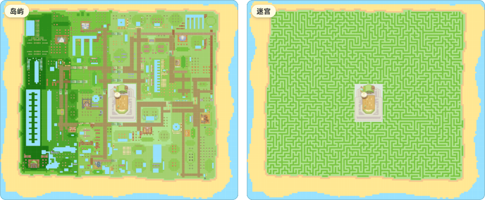

<sub>同一个配方号，两种玩法：<b>岛屿</b>造一座有人住的岛，<b>迷宫</b>把同一片地面铺成通道。</sub>
</div>

**岛屿**会先把整座岛设计好再动第一格：台地的大块布局、几条切分街区的长街、沿街安放的主题场所、嵌进地面的水系，最后是通到每家门口的道路。想改它的气质，动一根滑杆就够了：风景丰富度。

<div align="center">
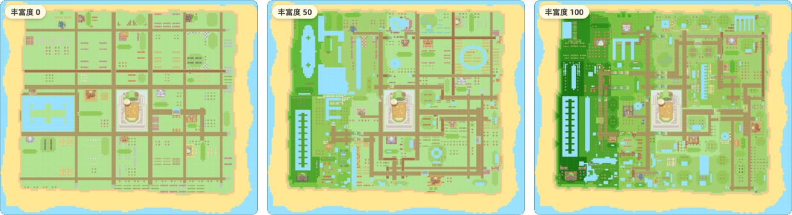

<sub>同一个配方，滑杆的整个量程：<b>丰富度</b> 0、50、100。左边是平坦的花园小镇，右边是层峦叠水的岛。</sub>
</div>

**迷宫**用递归回溯算法在可建造的地面上开出一座迷宫，任意两条通道都相通。它的墙体就是普通山体，生成之后照样能画、能切角、能装饰；它也认选区，所以迷宫可以只占地图的一角。入口和出口可以拖到你想要的位置，还能让它把答案铺成路。

<div align="center">
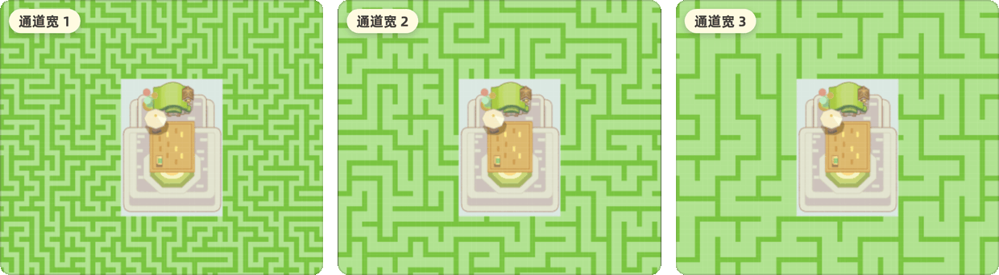

<sub><b>通道宽</b> 1、2、3：这个参数一共三档，这里全部列出。同一个配方号，通道越宽，墙体越少。</sub>
</div>

## 和你一起建图的智能体

密钥用你自己的：它加密保存在你的设备上，只发给你选定的平台；智能体只能改地图，没有存储权限、没有页面权限，也没有独立的网络出口。

<div align="center">
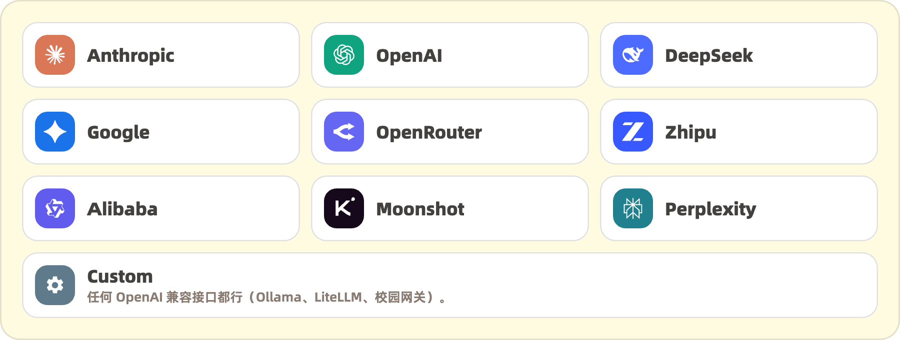

<sub>十个平台任选；最后一行是任何兼容 OpenAI 接口的服务，包括跑在你自己机器上的模型。</sub>
</div>

跟它要一个温馨村落、一片层叠的山地公园、一座跨河的桥、一道山间瀑布、一座枯山水庭园，或者一片梯田：它知道这些东西由什么组成，会直接建在你的地图上。

想在哪儿动工就指给它看：框住一片山坡，它就在那片山坡上施工。

它先把方案写出来，等你点头再开工。施工中你随时可以补一句话让它换个方向，让它在当前这一步结束后停下，或者退回前面某个阶段，从那里换条路重来。每个阶段都是一个回退点，一次撤销就能把整轮施工退回去。

<div align="center">
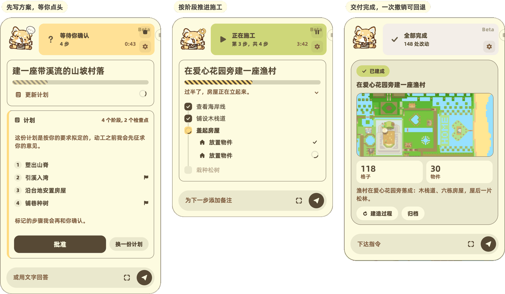

<sub>一次施工，三个时刻：方案等你点头，施工按阶段推进，回执写明建了什么，一次撤销可回退。</sub>
</div>

问得多勤由你定：**严格**每一处修改都等你同意，**检查点**只在方案和大步骤前询问、小修改直接进行，**YOLO** 一律不等。

它也会被拒绝。它和你的画笔走同一套检查，编辑器会用文字回答：

> **agent** · `paint_terrain` 在 F6 山脊铺水……
>
> **editor** · `REVERTED: Water: waterfall needs mountain caps on both ends`
>
> **agent** · 「瀑布两侧缺少山体封口。先补上，再重新铺水。」

## 背后的机制

<div align="center">
<picture>
  <source media="(prefers-color-scheme: dark)" srcset="./media/underhood-zh-dark.svg">
  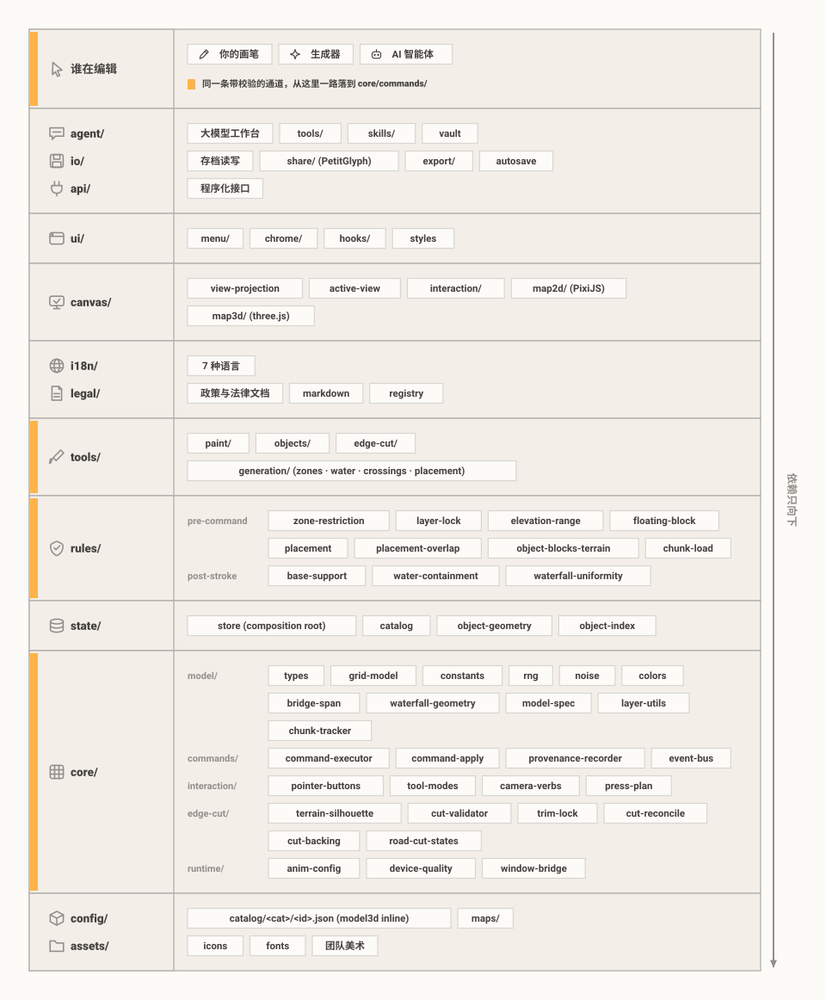
</picture>
</div>

写给想了解实现的读者和贡献者：编辑器保证的四条行为，以及它们分别由哪一层负责。

- **所有编辑走同一条通道。**画笔、生成器和智能体产出的都是命令，每条命令都经过同一个执行器（`core/commands/command-executor`），两侧各有一道校验：落笔前规则可以直接拒绝，落笔后再整体检查一次，结果不合规则就把这一笔整体回滚。
- **分享图要么完整导入，要么明确失败。**PetitGlyph 色带用 Reed-Solomon 纠错承载地图，数据末尾是整张地图的 SHA-256。导入时先解码重建再逐格比对：要么还原出导出时的地图，要么直接告诉你图片损坏。校验也不需要上传。
- **同一个配方永远生成同一座岛。**生成过程里的随机数全部来自同一个带种子的发生器（mulberry32），并列的选择一律按索引决定，所以同一个配方号在任何机器上都逐字节重放。这也是生成地图的分享码很小的原因：它存的是配方，不是地形。
- **这些行为由自动化测试保证。**`npm run test:run` 覆盖规则集、编解码和生成器，其中一个测试会导入本页那张分享图，图一旦失效，测试就会失败。

想深入了解：[ARCHITECTURE.md](./ARCHITECTURE.md)（引擎）与 [THREAT_MODEL.md](./THREAT_MODEL.md)（构建加固、CSP、密钥保管库与智能体沙箱，均为英文）。

## 快速开始

需要 [Node.js](https://nodejs.org) 24 或更新版本。

```bash
npm install
npm run dev          # Vite 开发服务器
```

<details>
<summary>其他命令（测试、检查、构建）</summary>

```bash
npm run test:run     # 运行全部测试（Vitest）
npm run lint         # TypeScript 类型检查（tsc --noEmit）
npm run build        # 生产构建
```

</details>

## 参与贡献

欢迎贡献。代码贡献按 **inbound = outbound** 原则接受 Apache-2.0 授权，并需要 **Developer Certificate of Origin** 签署（`git commit -s`）；美术等非代码素材的贡献则需要先建立单独的书面许可记录。完整流程见 [CONTRIBUTING.md](../CONTRIBUTING.md)（英文）。

## 隶属关系与授权

谷地工坊是一个独立的非官方粉丝项目，**与**米哈游及其海外品牌 HoYoverse（COGNOSPHERE PTE. LTD.）**无隶属关系**，未获其认可或赞助。《星布谷地》及相关名称、角色与素材归其各自权利人所有。

本仓库混合了不同授权条款的素材。**请不要因为代码开源，就认为美术、品牌或任何游戏相关素材也可以随意使用：**

1. **代码**：采用 **Apache-2.0** 授权（见 [LICENSE](../LICENSE) 与 [NOTICE](../NOTICE)）。
2. **品牌、Logo 与原创美术**：PetitMaker / 谷地工坊 的名称、Logo 及原创美术作品，除非特定文件另有声明，均为 **保留所有权利（All Rights Reserved）**。
3. **第三方素材与字体**：保留**其自身的授权条款**。详见 [THIRD_PARTY_NOTICES.md](./THIRD_PARTY_NOTICES.md)（英文）中列出的依赖库与内置字体。
4. **用户地图**：你在编辑器中创作的地图及其他内容归**你**所有，但其中包含的任何第三方素材仍受各自条款约束。编辑器为你的地图生成的截图与导出图片，虽然嵌入了我们的美术素材，但明确允许你直接分享；详见[素材许可](./ASSET_LICENSES.zh-CN.md)。

完整的权属说明、来源披露与知识产权投诉流程见[素材许可](./ASSET_LICENSES.zh-CN.md)。

## 鸣谢

按拼音字母顺序排列，不分先后。

<table align="center">
<tr>
<td align="center"><a href="https://space.bilibili.com/16699168"><br><sub><b>火山野牛王</b></sub></a></td>
<td align="center"><a href="https://space.bilibili.com/25599535"><br><sub><b>镜喵MirrorCat</b></sub></a></td>
<td align="center"><a href="https://space.bilibili.com/3546659724200757"><br><sub><b>Selka</b></sub></a></td>
<td align="center"><a href="https://space.bilibili.com/3632319829116985"><br><sub><b>鱼松吃点吗</b></sub></a></td>
</tr>
</table>

## 法律与政策文件

| 文件 | 用途 |
|---|---|
| [LICENSE](../LICENSE) | Apache-2.0 代码授权（英文） |
| [ASSET_LICENSES.md](./ASSET_LICENSES.md)（[中文版](./ASSET_LICENSES.zh-CN.md)） | 四类权属划分：代码 / 品牌与美术 / 第三方 / 用户地图 |
| [THIRD_PARTY_NOTICES.md](./THIRD_PARTY_NOTICES.md) | 内置依赖库与字体清单（英文） |
| [SECURITY.md](../SECURITY.md)（[中文版](./SECURITY.zh-CN.md)） | 安全漏洞报告政策 |
| [THREAT_MODEL.md](./THREAT_MODEL.md) | 开发者威胁模型（构建、标头/CSP、密钥保管库、智能体沙箱，英文） |
| [CONTRIBUTING.md](../CONTRIBUTING.md) | DCO 签署、代码/素材贡献条款、署名政策（英文） |
| [CHANGELOG.md](./CHANGELOG.md)（[中文版](./CHANGELOG.zh-CN.md)） | 版本历史（遵循 Keep a Changelog） |

## 联系我们

如有一般性问题、知识产权申诉，或希望商洽贡献/署名事宜，请发送邮件至 **selka.craft@outlook.com**。安全问题走单独流程。详见 [SECURITY.md](../SECURITY.md)。

<div align="center">
<br>


<sub>© 2026 PetitMaker contributors · Apache-2.0 · 非官方粉丝项目，与米哈游 / HoYoverse 无关</sub>
</div>
