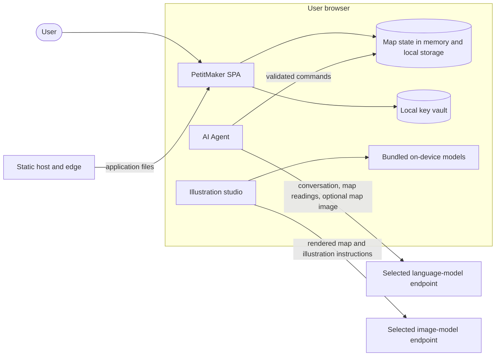

# Threat Model

**Developer documentation.** This is the security design reference for PetitMaker contributors and reviewers. Vulnerability reporting, safe-harbor terms and contact details live in [SECURITY.md](../SECURITY.md).

## Scope and trust boundaries

PetitMaker is a static client-side application. Its code and browser state are inspectable, and this project does not treat obscurity as a security control. The controls below protect provider keys at rest, constrain AI-initiated map edits, restrict executable content and make every network boundary explicit.

The app has no project-operated backend for map storage or AI proxying. The hosting and edge services deliver static files and receive ordinary web-request metadata. Map content leaves the browser only through a user-directed export or an AI feature the user starts.

The Agent may send the conversation, tool-produced map readings and, for a vision-capable model, rendered map snapshots. Online illustration requests may send the rendered map, style instructions, a scene summary and, when the selected workflow uses them, a bundled style sample or a prior take. Bundled procedural and neural illustration styles run in the browser and make no provider request.

## Security objectives and limits

The design aims to prevent untrusted content from becoming executable code, keep persisted secrets out of plaintext storage, limit AI tools to the map-editing contract and preserve user approval boundaries. It also reduces accidental disclosure through logs, source maps and error messages.

Code already executing in this origin can use a locally stored key, even when the key is sealed. A malicious browser extension, compromised device, successful same-origin script injection or compromised provider is outside the protection offered by the key vault. Users on shared or untrusted devices should avoid saving keys and should clear local data after use.

## Build and browser controls

### Production build

- Production builds disable source maps and drop ordinary `console` calls and `debugger` statements. The version banner contains only public build facts.
- Vite's module-preload polyfill is disabled, so the app needs no inline bootstrap script.
- Pixi's self-installed unsafe-eval patch removes its runtime `new Function` use. `script-src` permits same-origin scripts and WebAssembly compilation, but not JavaScript `eval`.
- `window.__PETIT_API` is present only in development builds.

### Headers and CSP

`security/headers-policy.ts` is the typed source for CSP and static response headers. The generator writes `public/_headers`, `vercel.json`, the CSP meta fallback in `index.html` and the rule set used for the ESA deployment. `npm run legal:headers:check` rejects drift.

The policy includes clickjacking protection, MIME sniffing protection, a strict referrer policy, a restricted permissions policy and HSTS. React's inline style objects require `style-src 'unsafe-inline'`; this does not relax `script-src`. Fonts and executable code remain same-origin.

The CSP meta fallback cannot enforce `frame-ancestors`, `X-Frame-Options` or HSTS. Production response headers are authoritative for those controls.

### Provider connections

Named origins in `connect-src` are derived from the Agent and illustration provider registries. Custom endpoints require the broader `https:` source plus HTTP loopback sources for local gateways. `sanitizeEndpointUrl` forces HTTPS for non-loopback hosts, removes embedded URL credentials and rewrites IPv6 loopback to `localhost` so it matches CSP.

The scheme-wide HTTPS allowance means CSP does not restrict a compromised same-origin script to the named providers. `script-src 'self'`, dependency review, input handling and key redaction therefore remain the controls against code injection and exfiltration. Custom base URLs are not secrets and are stored in local storage. A key entered on the connection screen is sent only to the built-in provider hosts whose key format it matches, or to a custom endpoint the user has chosen explicitly.

## API-key handling

`src/core/runtime/vault.ts` seals secrets with AES-GCM under a non-extractable WebCrypto key stored by IndexedDB. Non-extractable prevents scripts from exporting the key bytes; scripts running in this origin can still ask the browser to decrypt with that key.

Agent settings support older or restricted browsers by storing a base64-obfuscated key until the asynchronous vault upgrade succeeds. Obfuscation only prevents casual reading and is not encryption. Illustration-provider keys have no obfuscation fallback: if the vault cannot seal a key, it remains in memory for that browser session and is not persisted.

Provider keys go directly from the browser to the selected built-in or custom endpoint. They do not pass through a PetitMaker-operated server, are not intentionally logged and are removed from displayed or persisted provider error text by `src/agent/security/redact.ts`.

An unreadable sealed Agent blob is retained so temporary IndexedDB failure does not erase a user's stored key. A key removed while that blob is unreadable can reappear if the vault becomes readable later. Settings > Local data deletes local storage, session storage and the IndexedDB vault before reloading, which clears both readable and unreadable records.

## Agent threat model

- **Published prompts.** Prompts and skills ship with the application. They must contain no secrets or private operating material.
- **Tool boundary.** Tool inputs are schema-checked, and map mutations pass through the validated command executor. Agent tools cannot read browser storage, cookies or general network resources.
- **Narrow host capabilities.** `view_map` captures map pixels for a vision request. `export_map` asks the application UI to run its export flow; the tool does not write a file directly.
- **Atomic region lock.** When a region is active, every affected cell and complete object footprint must remain inside it. A violating tool call rolls back as one stroke.
- **Approval tiers.** Strict mode gates every write. Checkpoint mode gates plans and broad edits. Autopilot allows writes without those gates. The active tier is read again before each write.
- **Bounded work.** Parent and delegated jobs use the limits exported by `src/agent/core/governor.ts`. A delegated job cannot delegate again.
- **Imported data.** Imported maps are untrusted input. Share decoding synthesizes object identifiers, while JSON loading rejects unknown catalog identifiers and normalizes object identifiers before they can appear in tool output.
- **Provider output.** Model responses are untrusted. Only recognized message parts and schema-valid tool calls reach the executor; provider prose has no direct browser or storage capability.

The main remaining Agent impacts are undoable map edits, provider spend and disclosure of the request data described above. Approval gates, turn limits, rollback and the user's Stop control bound those impacts. Region violations and tool crashes roll back the whole call. Ordinary post-stroke validation can retain an earlier valid portion; tool feedback and the panel identify those retained edits. Cancellation is rechecked after approval and write waits, and persisted agent logs are structurally validated before they are projected into the UI or provider messages.

## Illustration threat model

- Procedural and bundled neural styles receive a rendered map in memory and return pixels in memory. Neural weights load from the same static origin and execute through ONNX Runtime in a module worker.
- Online styles send only the image and instruction package disclosed in the privacy policy. They do not receive the editable map document, local storage or Agent conversation.
- Returned image bytes, including bytes fetched from a provider-returned URL, are decoded into the session's version shelf. Generated takes are not persisted by the app unless the user exports them.
- The illustration key follows the vault-only persistence rule above. Its provider, model, custom endpoint, direction and custom prompt are ordinary local preferences.

## Residual risks

- `connect-src` admits every HTTPS origin so that custom endpoints work. A script executing in this origin can send stored keys anywhere. The accepted mitigations are the same-origin script policy, lockfile-pinned dependencies installed without lifecycle scripts, Dependabot review, and a publish pipeline whose token never shares a step with dependency code.
- Keys stored before the vault upgrade completes, or in browsers without WebCrypto and IndexedDB, are obfuscated rather than encrypted.
- Provider spend is bounded by turn limits and approval gates, not by a hard budget.

## Deployment checks

- Run `npm run legal:headers:check` and verify the generated response headers on each live deployment target.
- Serve production over HTTPS. Enable HSTS only on a host that consistently redirects or refuses plain HTTP.
- Keep the international deployment free of a Worker script: requests served by the static-asset layer are not billed, so a request flood cannot exhaust a Workers quota. Scheme and host redirects live in zone redirect rules; page aliases live in the generated `_redirects` file.
- Exercise at least one request for every built-in Agent and illustration provider after deployment; this catches CSP and CORS differences that static checks cannot observe.
- Run `npm audit --omit=dev` for the shipped dependency closure.
- Confirm the production build has no source maps, development API or unintended console output.

## Maintenance

Add an Agent provider in `src/agent/providers/defaults.ts` or an illustration provider in `src/io/stylize/providers.ts`. `security/headers-policy.ts` derives the named origins from those registries; run `npx vite-node scripts/generate-headers.mts` after changing either registry.

A new network transfer, stored secret, Agent host capability or executable asset requires a matching privacy review and an update to this threat model before release. Describe the shipped behavior and control here.
