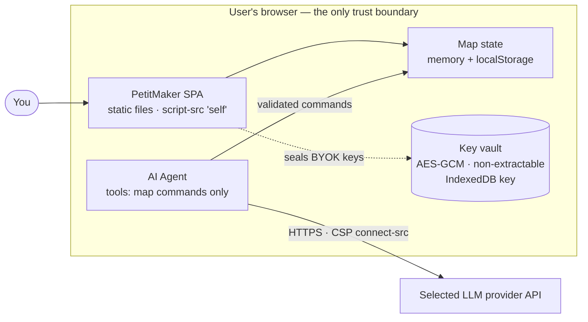

# Threat Model

**Developer documentation.** This is a technical reference for contributors and reviewers of PetitMaker, describing how the app is hardened and the assumptions behind that hardening. It is not part of the public vulnerability-reporting policy. For how to report a security problem, see [SECURITY.md](../SECURITY.md). This document is maintained in English and is not rendered in the app's web UI.

## Technical threat model

This is a **client-side SPA** (static files). The JavaScript runs in the user's browser, so the source is *inherently inspectable*: no client-side measure can truly hide it. The goal here is to **raise the bar** (no easy scraping/reuse, no needless exposure) with steps that cost nothing in performance or maintainability. We deliberately do **not** use JS obfuscation, right-click blocking, or devtools disabling: they're trivially bypassed and would hurt the FPS work + debuggability for no real gain.

At a glance — everything runs inside the one trust boundary (the browser), and the only data that ever leaves it is a BYOK agent call to the provider you chose. That call carries the conversation, map readings the tools produce, and — on a vision-capable model — rendered PNG snapshots of the user's map (`view_map`), so "the map leaves the browser" is part of the agent bargain, not a leak:

### What's in place

**Build (`vite.config.ts`)**
- `sourcemap: false`: never ship the readable source map.
- `esbuild.drop: ['console', 'debugger']` in production: no stray logging. Two deliberate survivors: the app's own version banner (`src/console-banner.ts` aliases `globalThis.console` specifically to outlive the dropper and prints the app name, version and repository URL — public facts, printed on purpose) and a pixi vendor `globalThis.console.warn` (harmless, not our code).
- `modulePreload.polyfill: false`: no inline `<script>`, so the CSP can keep a strict `script-src 'self'`.
- Minified (esbuild, Vite default).
- `@pixi/unsafe-eval` is applied by a bare side-effect import at the top of `src/canvas/map2d/map-renderer.ts` (it self-installs on import since pixi 7.1). PixiJS otherwise builds shaders with `new Function`, which a strict CSP blocks (`script-src 'self'` with no `'unsafe-eval'`). The patch removes that need, so we keep the strict CSP rather than adding `'unsafe-eval'`. Do NOT add `'unsafe-eval'` to the CSP; fix eval users this way instead.

**Headers / CSP**: one canonical policy, several generated surfaces. Production is TWO edges, both git-connected to the public repository: **Cloudflare Workers** serves `petit-maker.com` (the global site) and **Aliyun ESA Pages** serves `petitmaker.com.cn` (the mainland site); `src/legal/deploy-targets.ts` is where those facts live.
- `security/headers-policy.ts` is the single typed source (CSP directives, `X-Frame-Options: DENY`
  + CSP `frame-ancestors 'none'` (clickjacking), `X-Content-Type-Options: nosniff`, `Referrer-Policy`, `Permissions-Policy`, `Strict-Transport-Security`). `npx vite-node scripts/generate-headers.mts` regenerates every derived surface from it: `public/_headers` (read by the Cloudflare production edge and by any `_headers`-capable host — this file IS the global site's live header set, not a preview artifact), `vercel.json` (preview deploys), an ESA rule-set document (the rule set applied by hand in the ESA console for the mainland edge, which has no header file of its own; the generated document is withheld from the public snapshot), and the CSP `<meta>` in `index.html` (a portable fallback for hosts/contexts without header support). Drift-guarded by `src/__tests__/legal/headers-policy.test.ts` / `npm run legal:headers:check`. Never hand-edit the generated files.
- One deliberate relaxation: `style-src` carries `'unsafe-inline'`, because React inline styles and the pre-boot `<style>` block in `index.html` need it. `script-src` stays `'self'` with no inline and no eval; the style allowance does not extend to code.
- Note: `frame-ancestors`/`X-Frame-Options`/`Strict-Transport-Security` are header-only and ignored in a `<meta>` tag (`toCspMeta()` throws if forced to include one). A host that can only serve the meta fallback can't enforce clickjacking protection or HSTS; the production edges' headers are authoritative.

**App surface**
- `window.__PETIT_API` (full read/execute/export) is published **DEV-only** (`editor-api.ts`); it's gated out of the production bundle so injected scripts can't drive/scrape the map.

**Agent BYOK keys (`src/agent/security/key-storage.ts` + `src/agent/security/vault.ts`)**
- Keys are sealed at rest with **AES-GCM under a non-extractable WebCrypto key held in IndexedDB**; `localStorage` carries only ciphertext once the async upgrade lands (the key handle can be *used* by this origin but its bits can never be exported, not even by our own code). Where the vault is unavailable (old browsers, some private windows), keys fall back to base64 obfuscation.
- What that DEFEATS: casual localStorage inspection, disk forensics / backups of the browser profile's localStorage, and exfiltration that obtains storage content without code execution in this origin. What it does NOT defeat: XSS or a storage-capable extension running in the page. In-origin code can always use the key handle or capture keystrokes. No client-side scheme fixes that without a per-session user passphrase; we don't pretend otherwise.
- One residual worth knowing: a sealed blob the vault cannot currently open (`sealedUnread` in `key-storage.ts`) is carried through saves verbatim rather than dropped, so a key "forgotten" while the vault was unreadable can reappear once the vault opens again. Forgetting a key on a healthy vault removes it for good; Settings → "Local data" removes everything either way.
- Structural protections stay primary: keys never hit a server, go only to the endpoint the user configured over HTTPS (`connect-src` bounds the schemes; see the Custom-provider section for why it is scheme-wide rather than an origin allowlist), are never logged, and error text shown/stored in the chat transcript is scrubbed of key-shaped tokens (`src/agent/security/redact.ts`). Custom endpoint URLs are sanitized to https (loopback excepted) so a key never travels in cleartext. On shared machines, use Settings → "Local data" (two-step confirm): it wipes localStorage, sessionStorage, AND the IndexedDB vault key, then reloads (the in-app equivalent of clearing site data).

### Agent (LLM) threat model

- **The system prompt is public by design.** This is a client-side app: the prompt ships in the JS bundle, so "system prompt stealing" via the model is meaningless here. Treat every prompt/skill file as published documentation and never put secrets or proprietary logic in them. (If a hosted proxy with a private prompt ever exists, that changes; not today.)
- **Tool sandbox invariant.** Agent tools mutate map state ONLY through the validated `CommandExecutor` bridge, and never touch browser storage, cookies, or the network: a prompt-injected model must have nothing to exfiltrate with. Two declared, narrow host capabilities sit beside the map bridge — `view_map` renders the map to a PNG through the app's own snapshotter (the image goes to the user's chosen provider on a vision model, which is the one way map pixels leave the browser), and `export_map` only RAISES a UI request that the app's own export flow answers (the tool cannot write a file itself). Never add a capability beyond these without extending this section first. Worst case today is map vandalism (undoable, one stroke per tool call, and rolled back whole when it strays outside a marked region) and wasted API spend.
- **Region lock.** While the user has a region painted, it is a hard boundary for every write tool: commands are checked AS APPLIED (bridges and ramps snap during validation), an object counts by its whole footprint, and one stray cell rolls the entire call back and names the bounds. The lock rides into delegated subagent jobs by construction.
- **Spend bounds.** A job is capped at 40 turns. `delegate_task` spawns one child job at depth 1 with its own 20-turn cap and its own token budget, and the approval that admits the delegate call covers the child's writes — so the real bound is the parent cap plus one bounded child per approved delegate call, not the parent cap alone.
- **Injection surfaces.** The model's context contains: our prompts (trusted), rule/error strings (ours), the user's own messages, and the map. Third-party content enters only via imported maps: the PetitGlyph share path is safe by construction (catalog indexes, not strings; object ids are synthesized on decode), and the raw JSON loader drops any object whose `catalogId` is not a real catalog item AND replaces any object id outside the minter's own `[A-Za-z0-9_-]` alphabet (`io/json-codec.ts`), so a crafted save cannot smuggle instruction strings into `get_objects` output through either field.
- **User approval.** Oversight is a three-tier setting: `strict` gates every write, `checkpoint` (the default) gates wide writes and plans until a plan is approved, `yolo` never gates. A gate shows human-readable action summaries (`describe-call.ts`). "Always allow" is a standing session-wide answer, not a per-turn one, and the user can tighten the tier mid-run; the next write reads the new setting.

### Deploy checklist (static host)

- [ ] Global production (Cloudflare Workers, `petit-maker.com`): `public/_headers` ships to `dist/_headers` automatically and IS the live header set — verify it post-deploy. Vercel previews: `vercel.json` (repo root). Mainland production (Aliyun ESA Pages, `petitmaker.com.cn`): apply the generated ESA rule set in the ESA console (the generated rule-set document includes a "Verify live post-deploy" checklist), then verify it live.
- [ ] Serve over HTTPS only. HSTS is in the policy and live on the global edge; on the mainland edge it is held back until HTTPS-only serving is confirmed there (an HSTS header on a host that ever answers plain HTTP locks visitors out).
- [ ] Verify the CSP doesn't break the agent endpoints (open the console on a deployed build and exercise the agent for each provider).
- [ ] `npm audit --omit=dev` before a release (the shipped tree must stay at 0; this is a maintainer step, not an automated CI gate today). Plain `npm audit` also flags dev/test-only deps (e.g. esbuild's dev-server advisory via vite/vitest); those never reach the static bundle, so don't force-bump their majors just to clear the report; fix on real need.

### Maintenance

**Adding an agent provider:** add its origin to `connect-src` in **one place**, `security/headers-policy.ts`, then run `npx vite-node scripts/generate-headers.mts` to regenerate `index.html` (meta), `public/_headers`, `vercel.json`, and the ESA rule-set document from it. Otherwise the CSP blocks its API calls. (Because `connect-src` also carries the broad `https:` source for the Custom provider — next section — the named origins are documentation of intent rather than the enforcement line.)

**Custom (BYO-endpoint) provider:** the agent's "Custom" provider lets a user point at any OpenAI-compatible server, and it must work on the DEPLOYED site, not only in dev. `connect-src` therefore carries the broad `https:` scheme source plus loopback http (`http://localhost:*`, `http://127.0.0.1:*`, for Ollama/LiteLLM-style local gateways; CSP's host grammar cannot express an IPv6 literal, so an endpoint written as `[::1]` is rewritten to `localhost`) alongside the named provider origins (kept for documentation). This is a deliberate posture:

- What it does NOT weaken: `script-src 'self'` still forbids loading foreign code; the agent tool sandbox never touches the network; keys stay in the sealed vault and only travel to the endpoint the user explicitly configured (sanitized to https, loopback excepted, with any credentials embedded in the URL stripped).
- What it widens: a supply-chain-compromised or XSS-injected script could now exfiltrate to any https origin instead of only the named providers. That scenario is treated as hostile by other means (redaction, no-inline-script CSP, `npm audit` gate); `connect-src` is defence-in-depth for it, not the primary control.
- The dev-only `VITE_EXTRA_CONNECT_SRC` env hook (`vite.config.ts` → `devCspExtensionPlugin`, also read from a git-ignored `.env.local`) remains for non-https / exotic-scheme experiments in local dev.

The base URL itself is stored plain in localStorage (it is not a secret; the key is, and gets the same handling as every other provider key).
