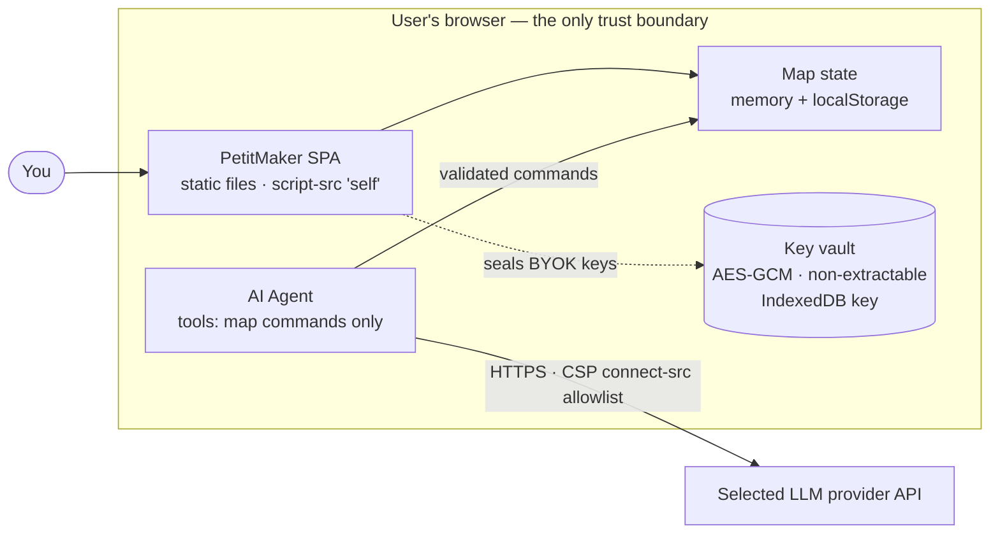

# Threat Model

**Developer documentation.** This is a technical reference for contributors and reviewers of PetitMaker, describing how the app is hardened and the assumptions behind that hardening. It is not part of the public vulnerability-reporting policy. For how to report a security problem, see [SECURITY.md](../SECURITY.md). This document is maintained in English and is not rendered in the app's web UI.

## Technical threat model

This is a **client-side SPA** (static files). The JavaScript runs in the user's browser, so the source is *inherently inspectable*: no client-side measure can truly hide it. The goal here is to **raise the bar** (no easy scraping/reuse, no needless exposure) with steps that cost nothing in performance or maintainability. We deliberately do **not** use JS obfuscation, right-click blocking, or devtools disabling: they're trivially bypassed and would hurt the FPS work + debuggability for no real gain.

At a glance — everything runs inside the one trust boundary (the browser), and the only data that ever leaves it is a BYOK agent call to the provider you chose:

### What's in place

**Build (`vite.config.ts`)**
- `sourcemap: false`: never ship the readable source map.
- `esbuild.drop: ['console', 'debugger']` in production: no stray logging (a single pixi vendor `globalThis.console.warn` survives; harmless, not our code).
- `modulePreload.polyfill: false`: no inline `<script>`, so the CSP can keep a strict `script-src 'self'`.
- Minified (esbuild, Vite default).
- `@pixi/unsafe-eval` is installed and applied in `renderer/map-renderer.ts` (`installUnsafeEval(PIXI)` at module load). PixiJS otherwise builds shaders with `new Function`, which a strict CSP blocks (`script-src 'self'` with no `'unsafe-eval'`). The patch removes that need, so we keep the strict CSP rather than adding `'unsafe-eval'`. Do NOT add `'unsafe-eval'` to the CSP; fix eval users this way instead.

**Headers / CSP**: one canonical policy, several generated surfaces:
- `security/headers-policy.ts` is the single typed source (CSP directives, `X-Frame-Options: DENY`
  + CSP `frame-ancestors 'none'` (clickjacking), `X-Content-Type-Options: nosniff`, `Referrer-Policy`, `Permissions-Policy`, `Strict-Transport-Security`). `npx vite-node scripts/generate-headers.mts` regenerates every derived surface from it: `public/_headers` (Netlify preview), `vercel.json` (Vercel preview), an ESA rule-set document (the documented rule set applied on **Alibaba ESA**, the production edge; ESA has no repo-committed header config, and this document is kept with the maintainers' private deployment notes), and the CSP `<meta>` in `index.html` (a portable fallback for hosts/contexts without header support). Drift-guarded by `src/__tests__/legal/headers-policy.test.ts` / `npm run legal:headers:check`. Never hand-edit the generated files.
- Note: `frame-ancestors`/`X-Frame-Options`/`Strict-Transport-Security` are header-only and ignored in a `<meta>` tag (`toCspMeta()` throws if forced to include one). A host that can only serve the meta fallback can't enforce clickjacking protection or HSTS; production headers (ESA) are authoritative.

**App surface**
- `window.__PETIT_API` (full read/execute/export) is published **DEV-only** (`editor-api.ts`); it's gated out of the production bundle so injected scripts can't drive/scrape the map.

**Agent BYOK keys (`src/agent/key-storage.ts` + `src/agent/vault.ts`)**
- Keys are sealed at rest with **AES-GCM under a non-extractable WebCrypto key held in IndexedDB**; `localStorage` carries only ciphertext once the async upgrade lands (the key handle can be *used* by this origin but its bits can never be exported, not even by our own code). Where the vault is unavailable (old browsers, some private windows), keys fall back to base64 obfuscation.
- What that DEFEATS: casual localStorage inspection, disk forensics / backups of the browser profile's localStorage, and exfiltration that obtains storage content without code execution in this origin. What it does NOT defeat: XSS or a storage-capable extension running in the page. In-origin code can always use the key handle or capture keystrokes. No client-side scheme fixes that without a per-session user passphrase; we don't pretend otherwise.
- Structural protections stay primary: keys never hit a server, go only to the selected provider's HTTPS API (allow-listed in CSP `connect-src`), are never logged, and error text shown/stored in the chat transcript is scrubbed of key-shaped tokens (`src/agent/redact.ts`). Custom endpoint URLs are sanitized to https (loopback excepted) so a key never travels in cleartext. On shared machines, use Settings → "Local data" (two-step confirm): it wipes localStorage, sessionStorage, AND the IndexedDB vault key, then reloads (the in-app equivalent of clearing site data).

### Agent (LLM) threat model

- **The system prompt is public by design.** This is a client-side app: the prompt ships in the JS bundle, so "system prompt stealing" via the model is meaningless here. Treat every prompt/skill file as published documentation and never put secrets or proprietary logic in them. (If a hosted proxy with a private prompt ever exists, that changes; not today.)
- **Tool sandbox invariant.** Agent tools may ONLY read/mutate map state through the validated `CommandExecutor` bridge. Never add a tool that can touch browser storage, cookies, the DOM, or make network requests: a prompt-injected model must have nothing to exfiltrate with. Worst case today is map vandalism (undoable, one stroke per tool call) and wasted API spend (bounded by the 40-turn cap and the approval gate).
- **Injection surfaces.** The model's context contains: our prompts (trusted), rule/error strings (ours), the user's own messages, and the map. Third-party content enters only via imported maps: the PetitGlyph share path is safe by construction (catalog indexes, not strings), and the raw JSON loader drops any object whose `catalogId` is not a real catalog item (`io/json-codec.ts`), so crafted saves cannot smuggle instruction strings into `get_objects` output.
- **User approval.** The "ask before edits" gate shows human-readable action summaries (`describe-call.ts`); "allow all" is scoped to the current turn only.

### Deploy checklist (static host)

- [ ] Netlify: `public/_headers` ships to `dist/_headers` automatically. Vercel: `vercel.json` (repo root). Production (Alibaba OSS/ESA): apply the generated ESA rule set in the ESA console/API (maintainers: the generated rule-set document, kept privately, includes a "Verify live post-deploy" checklist), then verify it live.
- [ ] Serve over HTTPS only (HSTS is set; consider `preload` once stable).
- [ ] Verify the CSP doesn't break the agent endpoints (open the console on a deployed build and exercise the agent for each provider).
- [ ] `npm audit --omit=dev` in CI (the shipped tree must stay at 0). Plain `npm audit` also flags dev/test-only deps (e.g. esbuild's dev-server advisory via vite/vitest); those never reach the static bundle, so don't force-bump their majors just to clear the report; fix on real need.

### Maintenance

**Adding an agent provider:** add its origin to `connect-src` in **one place**, `security/headers-policy.ts`, then run `npx vite-node scripts/generate-headers.mts` to regenerate `index.html` (meta), `public/_headers`, `vercel.json`, and the ESA rule-set document from it. Otherwise the CSP blocks its API calls.

**Custom (BYO-endpoint) provider:** the agent's "Custom" provider lets a user point at any OpenAI-compatible server, and it must work on the DEPLOYED site, not only in dev. `connect-src` therefore carries the broad `https:` scheme source plus loopback http (`http://localhost:*`, `http://127.0.0.1:*`, for Ollama/LiteLLM-style local gateways) alongside the named provider origins (kept for documentation). This is a deliberate posture:

- What it does NOT weaken: `script-src 'self'` still forbids loading foreign code; the agent tool sandbox never touches the network; keys stay in the sealed vault and only travel to the endpoint the user explicitly configured (sanitized to https, loopback excepted).
- What it widens: a supply-chain-compromised or XSS-injected script could now exfiltrate to any https origin instead of only the named providers. That scenario was already treated as hostile (redaction, no-inline-script CSP, `npm audit` gate); `connect-src` was defense-in-depth for it, not the primary control.
- The dev-only `VITE_EXTRA_CONNECT_SRC` env hook (`vite.config.ts` → `devCspExtensionPlugin`, also read from a git-ignored `.env.local`) remains for non-https / exotic-scheme experiments in local dev.

The base URL itself is stored plain in localStorage (it is not a secret; the key is, and gets the same handling as every other provider key).
